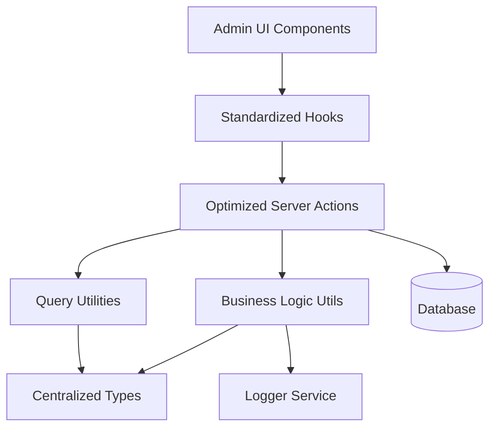
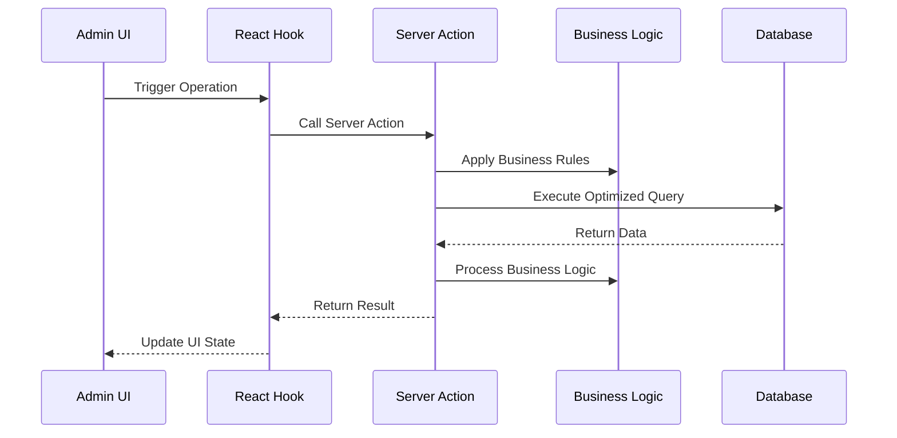

# Design Document

## Overview

This design document outlines the comprehensive improvement of the affiliation management system for admin users. The solution focuses on centralizing types, optimizing database operations, standardizing patterns, and improving maintainability while preserving all existing functionality.

## Architecture

### High-Level Architecture



### Data Flow Architecture



## Components and Interfaces

### 1. Centralized Type System

#### Core Types Location: `lib/types/affiliations/index.ts`

```typescript
// Base affiliation types
export type AffiliationBase = typeof affiliations.$inferSelect;
export type AffiliationInsert = typeof affiliations.$inferInsert;

// Comprehensive joined data types
export interface AffiliationWithDetails {
  affiliation: AffiliationBase;
  courses: CourseBase[] | null;
}

// List view optimized type
export interface AffiliationListItem {
  id: string;
  name: string;
  type: string;
  description: string | null;
  created_at: string;
  updated_at: string;
  course_count: number;
}

// Query parameter types
export interface AffiliationQueryParams {
  page?: number;
  pageSize?: number;
  sortBy?: string;
  order?: 'asc' | 'desc';
  filters?: ColumnFiltersState;
  search?: string;
}

// Business operation types
export interface AffiliationCreateData {
  name: string;
  type: string;
  description?: string;
}

export interface AffiliationUpdateData {
  id: string;
  name: string;
  type: string;
  description?: string;
}
```

### 2. Optimized Server Actions

#### Structure: `lib/server-actions/admin/affiliations.ts`

```typescript
// Single comprehensive list function
export async function adminAffiliationList(params: AffiliationQueryParams): Promise<ApiResponse<{
  data: AffiliationListItem[];
  total: number;
  page: number;
  pageSize: number;
}>>

// Single comprehensive details function
export async function adminAffiliationDetails(id: string): Promise<ApiResponse<AffiliationWithDetails>>

// Optimized CRUD operations
export async function adminAffiliationCreate(data: AffiliationCreateData): Promise<ApiResponse<AffiliationBase>>
export async function adminAffiliationUpdate(data: AffiliationUpdateData): Promise<ApiResponse<AffiliationBase>>
export async function adminAffiliationDelete(id: string): Promise<ApiResponse<void>>

// Business operations
export async function adminAffiliationCheckConstraints(id: string): Promise<ApiResponse<{ canDelete: boolean; courseCount: number }>>
```

### 3. Business Logic Utilities

#### Structure: `lib/utils/affiliations/index.ts`

```typescript
// Affiliation validation
export function validateAffiliationData(data: AffiliationCreateData | AffiliationUpdateData): ValidationResult

// Constraint checking
export async function checkAffiliationConstraints(id: string): Promise<{ canDelete: boolean; courseCount: number }>

// Business rule enforcement
export function canUpdateAffiliationType(currentType: string, newType: string): boolean
```

### 4. Standardized Hooks

#### Structure: `hooks/admin/affiliations.ts`

```typescript
// List operations
export function useAdminAffiliationList(params: AffiliationQueryParams)
export function useAdminAffiliationSearch(search: string)

// Detail operations
export function useAdminAffiliationDetails(id: string)

// Mutation operations
export function useAdminAffiliationCreate()
export function useAdminAffiliationUpdate()
export function useAdminAffiliationDelete()
export function useAdminAffiliationConstraintCheck()

// Specialized operations
export function useAdminAffiliationMetrics()
export function useAdminAffiliationExport()
```

### 5. Query Optimization

#### Column Maps and Select Patterns

```typescript
// Optimized column mappings
export const affiliationColumnMap = {
  id: affiliationSchema.id,
  name: affiliationSchema.name,
  type: affiliationSchema.type,
  description: affiliationSchema.description,
  created_at: affiliationSchema.created_at,
  updated_at: affiliationSchema.updated_at,
  course_count: sql<number>`count(courses.id)`,
};

// Optimized select patterns
export const affiliationListSelect = {
  id: affiliationSchema.id,
  name: affiliationSchema.name,
  type: affiliationSchema.type,
  description: affiliationSchema.description,
  created_at: affiliationSchema.created_at,
  updated_at: affiliationSchema.updated_at,
  course_count: sql<number>`count(courses.id)`,
};
```

## Data Models

### Database Query Patterns

#### Optimized List Query
```sql
SELECT 
  a.id, a.name, a.type, a.description, a.created_at, a.updated_at,
  COUNT(c.id) as course_count
FROM affiliations a
LEFT JOIN courses c ON a.id = c.affiliation_id
WHERE [dynamic filters]
GROUP BY a.id, a.name, a.type, a.description, a.created_at, a.updated_at
ORDER BY [dynamic sorting]
LIMIT ? OFFSET ?
```

#### Optimized Details Query
```sql
SELECT 
  a.*,
  c.* as courses
FROM affiliations a
LEFT JOIN courses c ON a.id = c.affiliation_id
WHERE a.id = ?
```

### Caching Strategy

```typescript
// Query key structure
const affiliationQueryKeys = {
  all: ['affiliations'] as const,
  lists: () => [...affiliationQueryKeys.all, 'list'] as const,
  list: (params: AffiliationQueryParams) => [...affiliationQueryKeys.lists(), params] as const,
  details: () => [...affiliationQueryKeys.all, 'detail'] as const,
  detail: (id: string) => [...affiliationQueryKeys.details(), id] as const,
  byType: (type: string) => [...affiliationQueryKeys.all, 'type', type] as const,
  metrics: () => [...affiliationQueryKeys.all, 'metrics'] as const,
};

// Cache invalidation patterns
const invalidationPatterns = {
  onAffiliationCreate: [affiliationQueryKeys.all],
  onAffiliationUpdate: (id: string) => [
    affiliationQueryKeys.all,
    affiliationQueryKeys.detail(id)
  ],
  onAffiliationDelete: (id: string) => [
    affiliationQueryKeys.all,
    affiliationQueryKeys.detail(id)
  ],
};
```

## Error Handling

### Standardized Error Response Format

```typescript
interface ApiResponse<T> {
  success: boolean;
  data?: T;
  error?: string;
  code?: string;
  details?: Record<string, any>;
}

// Error handling utility
export function handleAffiliationError(error: unknown, operation: string): ApiResponse<never> {
  if (error instanceof ValidationError) {
    return {
      success: false,
      error: error.message,
      code: 'VALIDATION_ERROR',
      details: error.details
    };
  }
  
  if (error instanceof DatabaseError) {
    logger.error(`Affiliation ${operation} failed:`, error);
    return {
      success: false,
      error: 'Database operation failed',
      code: 'DATABASE_ERROR'
    };
  }
  
  logger.error(`Unexpected error in affiliation ${operation}:`, error);
  return {
    success: false,
    error: 'An unexpected error occurred',
    code: 'UNKNOWN_ERROR'
  };
}
```

### Business Rule Validation

```typescript
export class AffiliationValidationError extends Error {
  constructor(
    message: string,
    public code: string,
    public details?: Record<string, any>
  ) {
    super(message);
    this.name = 'AffiliationValidationError';
  }
}

export function validateAffiliationName(name: string): void {
  if (name.length < 3) {
    throw new AffiliationValidationError(
      'Name must be at least 3 characters long',
      'NAME_TOO_SHORT',
      { name, length: name.length }
    );
  }
  
  if (name.length > 255) {
    throw new AffiliationValidationError(
      'Name cannot exceed 255 characters',
      'NAME_TOO_LONG',
      { name, length: name.length }
    );
  }
}
```

## Testing Strategy

### Unit Testing Approach

```typescript
// Server action tests
describe('adminAffiliationList', () => {
  it('should return paginated affiliation list with proper joins');
  it('should handle filters correctly');
  it('should handle sorting correctly');
  it('should handle empty results gracefully');
});

// Business logic tests
describe('affiliation business logic', () => {
  it('should validate affiliation names correctly');
  it('should check constraints properly');
  it('should handle type validation correctly');
});

// Hook tests
describe('affiliation hooks', () => {
  it('should invalidate cache correctly on mutations');
  it('should handle loading states properly');
  it('should handle error states correctly');
});
```

### Integration Testing

```typescript
// End-to-end affiliation flow tests
describe('affiliation management flow', () => {
  it('should create affiliation and associate with courses');
  it('should update affiliation details');
  it('should prevent deletion of affiliations with courses');
  it('should maintain data consistency across operations');
});
```

## Performance Considerations

### Database Optimization
- Use proper indexes on frequently queried columns
- Implement query result caching for list operations
- Use connection pooling for concurrent requests
- Optimize JOIN operations with proper foreign key relationships

### Frontend Optimization
- Implement proper React Query caching strategies
- Use optimistic updates for better UX
- Implement virtual scrolling for large lists
- Use proper loading states and skeleton screens

### Memory Management
- Implement proper cleanup in React hooks
- Use weak references where appropriate
- Implement proper garbage collection for large datasets
- Monitor memory usage in production

## Security Considerations

### Access Control
- Implement proper role-based access control
- Validate user permissions for each operation
- Audit trail for all affiliation modifications
- Rate limiting for API endpoints

### Data Validation
- Server-side validation for all inputs
- SQL injection prevention through parameterized queries
- XSS prevention in user-generated content
- CSRF protection for state-changing operations

### Privacy Protection
- Proper data anonymization for exports
- Secure handling of personal information
- Compliance with data protection regulations
- Secure logging without sensitive data exposure