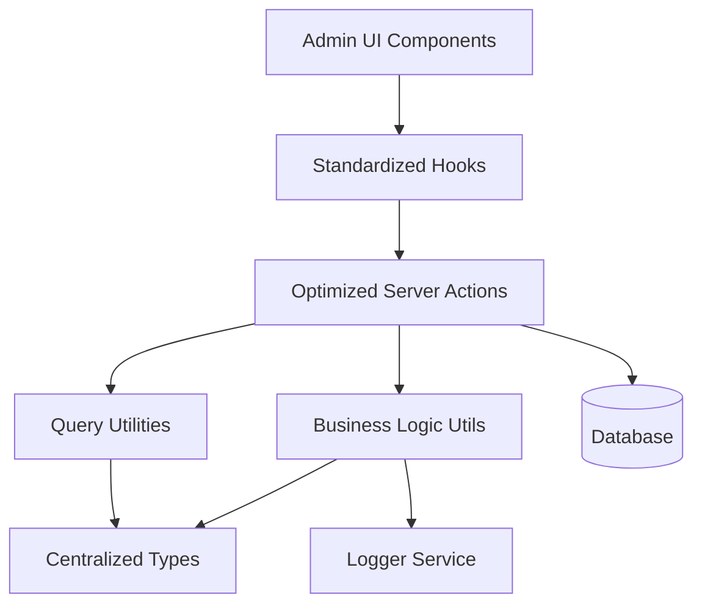
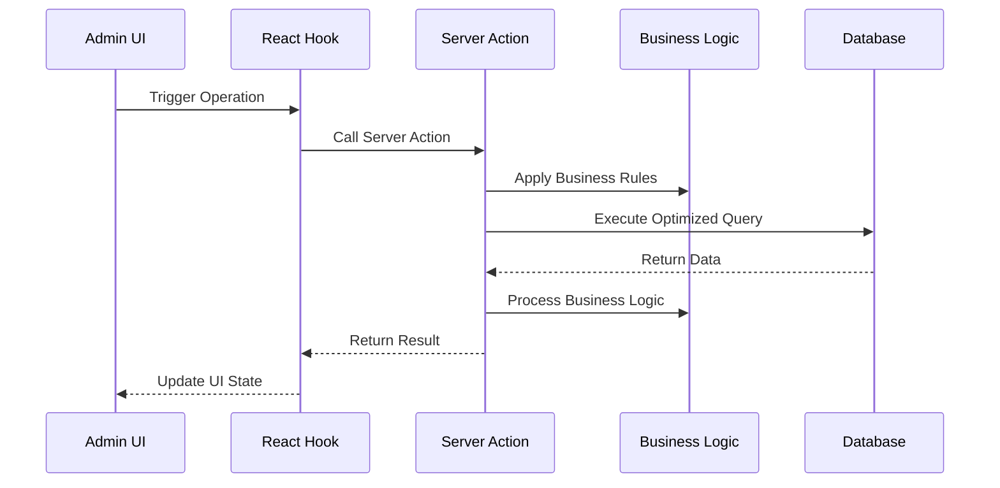

# Design Document

## Overview

This design document outlines the comprehensive improvement of the course category management system for admin users. The solution focuses on centralizing types, optimizing database operations, standardizing patterns, and improving maintainability while preserving all existing functionality.

## Architecture

### High-Level Architecture



### Data Flow Architecture



## Components and Interfaces

### 1. Centralized Type System

#### Core Types Location: `lib/types/course-categories/index.ts`

```typescript
// Base course category types
export type CourseCategoryBase = typeof courseCategories.$inferSelect;
export type CourseCategoryInsert = typeof courseCategories.$inferInsert;

// Comprehensive joined data types
export interface CourseCategoryWithDetails {
  category: CourseCategoryBase;
  courses: CourseBase[] | null;
}

// List view optimized type
export interface CourseCategoryListItem {
  id: string;
  name: string;
  description: string | null;
  created_at: string;
  updated_at: string;
  course_count: number;
}

// Query parameter types
export interface CourseCategoryQueryParams {
  page?: number;
  pageSize?: number;
  sortBy?: string;
  order?: 'asc' | 'desc';
  filters?: ColumnFiltersState;
  search?: string;
}

// Business operation types
export interface CourseCategoryCreateData {
  name: string;
  description?: string;
}

export interface CourseCategoryUpdateData {
  id: string;
  name: string;
  description?: string;
}
```

### 2. Optimized Server Actions

#### Structure: `lib/server-actions/admin/course-categories.ts`

```typescript
// Single comprehensive list function
export async function adminCourseCategoryList(params: CourseCategoryQueryParams): Promise<ApiResponse<{
  data: CourseCategoryListItem[];
  total: number;
  page: number;
  pageSize: number;
}>>

// Single comprehensive details function
export async function adminCourseCategoryDetails(id: string): Promise<ApiResponse<CourseCategoryWithDetails>>

// Optimized CRUD operations
export async function adminCourseCategoryCreate(data: CourseCategoryCreateData): Promise<ApiResponse<CourseCategoryBase>>
export async function adminCourseCategoryUpdate(data: CourseCategoryUpdateData): Promise<ApiResponse<CourseCategoryBase>>
export async function adminCourseCategoryDelete(id: string): Promise<ApiResponse<void>>

// Business operations
export async function adminCourseCategoryCheckConstraints(id: string): Promise<ApiResponse<{ canDelete: boolean; courseCount: number }>>
```

### 3. Business Logic Utilities

#### Structure: `lib/utils/course-categories/index.ts`

```typescript
// Course category validation
export function validateCourseCategoryData(data: CourseCategoryCreateData | CourseCategoryUpdateData): ValidationResult

// Constraint checking
export async function checkCourseCategoryConstraints(id: string): Promise<{ canDelete: boolean; courseCount: number }>

// Business rule enforcement
export function validateCategoryName(name: string): boolean
```

### 4. Standardized Hooks

#### Structure: `hooks/admin/course-categories.ts`

```typescript
// List operations
export function useAdminCourseCategoryList(params: CourseCategoryQueryParams)
export function useAdminCourseCategorySearch(search: string)

// Detail operations
export function useAdminCourseCategoryDetails(id: string)

// Mutation operations
export function useAdminCourseCategoryCreate()
export function useAdminCourseCategoryUpdate()
export function useAdminCourseCategoryDelete()
export function useAdminCourseCategoryConstraintCheck()

// Specialized operations
export function useAdminCourseCategoryMetrics()
export function useAdminCourseCategoryExport()
```

### 5. Query Optimization

#### Column Maps and Select Patterns

```typescript
// Optimized column mappings
export const courseCategoryColumnMap = {
  id: categorySchema.id,
  name: categorySchema.name,
  description: categorySchema.description,
  created_at: categorySchema.created_at,
  updated_at: categorySchema.updated_at,
  course_count: sql<number>`count(courses.id)`,
};

// Optimized select patterns
export const courseCategoryListSelect = {
  id: categorySchema.id,
  name: categorySchema.name,
  description: categorySchema.description,
  created_at: categorySchema.created_at,
  updated_at: categorySchema.updated_at,
  course_count: sql<number>`count(courses.id)`,
};
```

## Data Models

### Database Query Patterns

#### Optimized List Query
```sql
SELECT 
  cc.id, cc.name, cc.description, cc.created_at, cc.updated_at,
  COUNT(c.id) as course_count
FROM course_categories cc
LEFT JOIN courses c ON cc.id = c.category_id
WHERE [dynamic filters]
GROUP BY cc.id, cc.name, cc.description, cc.created_at, cc.updated_at
ORDER BY [dynamic sorting]
LIMIT ? OFFSET ?
```

#### Optimized Details Query
```sql
SELECT 
  cc.*,
  c.* as courses
FROM course_categories cc
LEFT JOIN courses c ON cc.id = c.category_id
WHERE cc.id = ?
```

### Caching Strategy

```typescript
// Query key structure
const courseCategoryQueryKeys = {
  all: ['course-categories'] as const,
  lists: () => [...courseCategoryQueryKeys.all, 'list'] as const,
  list: (params: CourseCategoryQueryParams) => [...courseCategoryQueryKeys.lists(), params] as const,
  details: () => [...courseCategoryQueryKeys.all, 'detail'] as const,
  detail: (id: string) => [...courseCategoryQueryKeys.details(), id] as const,
  byName: (name: string) => [...courseCategoryQueryKeys.all, 'name', name] as const,
  metrics: () => [...courseCategoryQueryKeys.all, 'metrics'] as const,
};

// Cache invalidation patterns
const invalidationPatterns = {
  onCategoryCreate: [courseCategoryQueryKeys.all],
  onCategoryUpdate: (id: string) => [
    courseCategoryQueryKeys.all,
    courseCategoryQueryKeys.detail(id)
  ],
  onCategoryDelete: (id: string) => [
    courseCategoryQueryKeys.all,
    courseCategoryQueryKeys.detail(id)
  ],
};
```

## Error Handling

### Standardized Error Response Format

```typescript
interface ApiResponse<T> {
  success: boolean;
  data?: T;
  error?: string;
  code?: string;
  details?: Record<string, any>;
}

// Error handling utility
export function handleCourseCategoryError(error: unknown, operation: string): ApiResponse<never> {
  if (error instanceof ValidationError) {
    return {
      success: false,
      error: error.message,
      code: 'VALIDATION_ERROR',
      details: error.details
    };
  }
  
  if (error instanceof DatabaseError) {
    logger.error(`Course Category ${operation} failed:`, error);
    return {
      success: false,
      error: 'Database operation failed',
      code: 'DATABASE_ERROR'
    };
  }
  
  logger.error(`Unexpected error in course category ${operation}:`, error);
  return {
    success: false,
    error: 'An unexpected error occurred',
    code: 'UNKNOWN_ERROR'
  };
}
```

### Business Rule Validation

```typescript
export class CourseCategoryValidationError extends Error {
  constructor(
    message: string,
    public code: string,
    public details?: Record<string, any>
  ) {
    super(message);
    this.name = 'CourseCategoryValidationError';
  }
}

export function validateCategoryName(name: string): void {
  if (name.length < 3) {
    throw new CourseCategoryValidationError(
      'Name must be at least 3 characters long',
      'NAME_TOO_SHORT',
      { name, length: name.length }
    );
  }
  
  if (name.length > 255) {
    throw new CourseCategoryValidationError(
      'Name cannot exceed 255 characters',
      'NAME_TOO_LONG',
      { name, length: name.length }
    );
  }
}
```

## Testing Strategy

### Unit Testing Approach

```typescript
// Server action tests
describe('adminCourseCategoryList', () => {
  it('should return paginated course category list with proper joins');
  it('should handle filters correctly');
  it('should handle sorting correctly');
  it('should handle empty results gracefully');
});

// Business logic tests
describe('course category business logic', () => {
  it('should validate category names correctly');
  it('should check constraints properly');
  it('should handle validation correctly');
});

// Hook tests
describe('course category hooks', () => {
  it('should invalidate cache correctly on mutations');
  it('should handle loading states properly');
  it('should handle error states correctly');
});
```

### Integration Testing

```typescript
// End-to-end course category flow tests
describe('course category management flow', () => {
  it('should create course category and associate with courses');
  it('should update course category details');
  it('should prevent deletion of categories with courses');
  it('should maintain data consistency across operations');
});
```

## Performance Considerations

### Database Optimization
- Use proper indexes on frequently queried columns
- Implement query result caching for list operations
- Use connection pooling for concurrent requests
- Optimize JOIN operations with proper foreign key relationships

### Frontend Optimization
- Implement proper React Query caching strategies
- Use optimistic updates for better UX
- Implement virtual scrolling for large lists
- Use proper loading states and skeleton screens

### Memory Management
- Implement proper cleanup in React hooks
- Use weak references where appropriate
- Implement proper garbage collection for large datasets
- Monitor memory usage in production

## Security Considerations

### Access Control
- Implement proper role-based access control
- Validate user permissions for each operation
- Audit trail for all course category modifications
- Rate limiting for API endpoints

### Data Validation
- Server-side validation for all inputs
- SQL injection prevention through parameterized queries
- XSS prevention in user-generated content
- CSRF protection for state-changing operations

### Privacy Protection
- Proper data anonymization for exports
- Secure handling of personal information
- Compliance with data protection regulations
- Secure logging without sensitive data exposure