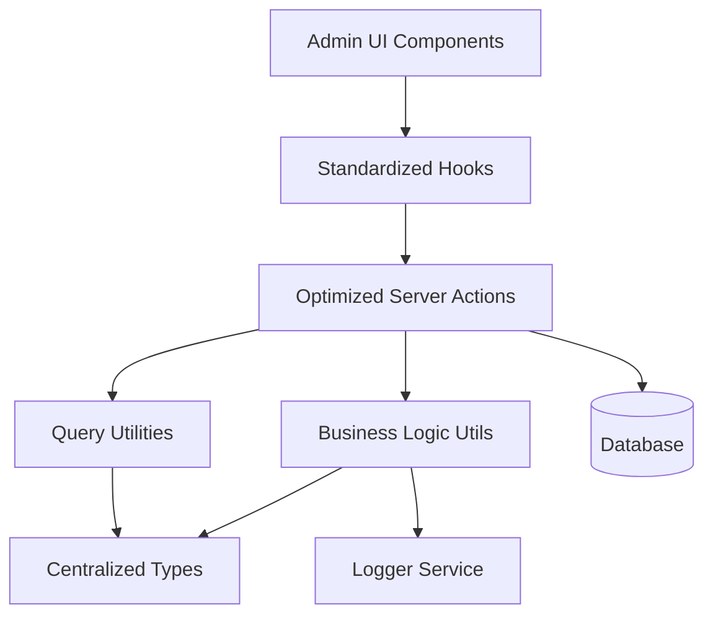
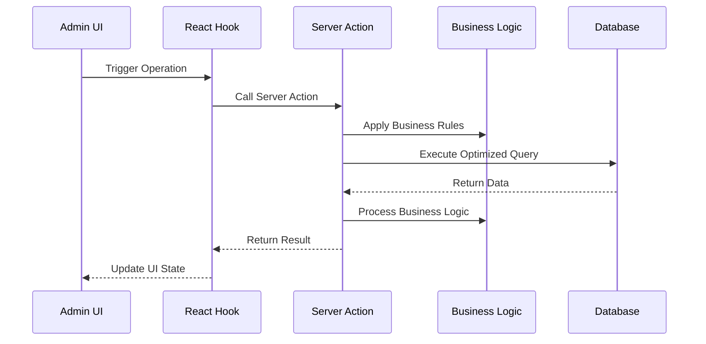

# Design Document

## Overview

This design document outlines the comprehensive improvement of the course management system for admin users. The solution focuses on centralizing types, optimizing database operations, standardizing patterns, and improving maintainability while preserving all existing functionality.

## Architecture

### High-Level Architecture



### Data Flow Architecture



## Components and Interfaces

### 1. Centralized Type System

#### Core Types Location: `lib/types/courses/index.ts`

```typescript
// Base course types
export type CourseBase = typeof courses.$inferSelect;
export type CourseInsert = typeof courses.$inferInsert;

// Related types
export type CategoryBase = typeof courseCategories.$inferSelect;
export type AffiliationBase = typeof affiliations.$inferSelect;
export type IntakeBase = typeof intakes.$inferSelect;

// Comprehensive joined data types
export interface CourseWithDetails {
  course: CourseBase;
  category: CategoryBase | null;
  affiliation: AffiliationBase | null;
  intakes: IntakeBase[] | null;
}

// List view optimized type
export interface CourseListItem {
  id: string;
  title: string;
  slug: string;
  price: number;
  level: number;
  duration_type: string;
  duration_value: number;
  created_at: string;
  updated_at: string;
  category: {
    id: string;
    name: string;
  } | null;
  affiliation: {
    id: string;
    name: string;
  } | null;
  intake_count: number;
  enrollment_count: number;
}

// Query parameter types
export interface CourseQueryParams {
  page?: number;
  pageSize?: number;
  sortBy?: string;
  order?: 'asc' | 'desc';
  filters?: ColumnFiltersState;
  search?: string;
}

// Business operation types
export interface CourseCreateData {
  category_id?: string;
  affiliation_id?: string;
  title: string;
  slug: string;
  courseHighlights?: string;
  courseOverview?: string;
  image_url?: string;
  level: number;
  duration_type: string;
  duration_value: number;
  price: number;
}

export interface CourseUpdateData {
  id: string;
  category_id?: string;
  affiliation_id?: string;
  title: string;
  slug: string;
  courseHighlights?: string;
  courseOverview?: string;
  image_url?: string;
  level: number;
  duration_type: string;
  duration_value: number;
  price: number;
}
```

### 2. Optimized Server Actions

#### Structure: `lib/server-actions/admin/courses.ts`

```typescript
// Single comprehensive list function
export async function adminCourseList(params: CourseQueryParams): Promise<ApiResponse<{
  data: CourseListItem[];
  total: number;
  page: number;
  pageSize: number;
}>>

// Single comprehensive details function
export async function adminCourseDetails(id: string): Promise<ApiResponse<CourseWithDetails>>

// Optimized CRUD operations
export async function adminCourseCreate(data: CourseCreateData): Promise<ApiResponse<CourseBase>>
export async function adminCourseUpdate(data: CourseUpdateData): Promise<ApiResponse<CourseBase>>
export async function adminCourseDelete(id: string): Promise<ApiResponse<void>>

// Business operations
export async function adminCourseCheckConstraints(id: string): Promise<ApiResponse<{ canDelete: boolean; intakeCount: number; enrollmentCount: number }>>
export async function adminCourseImageUpload(file: File, courseId: string): Promise<ApiResponse<string>>
export async function adminCourseImageDelete(imageUrl: string, courseId: string): Promise<ApiResponse<void>>
```

### 3. Business Logic Utilities

#### Structure: `lib/utils/courses/index.ts`

```typescript
// Course validation
export function validateCourseData(data: CourseCreateData | CourseUpdateData): ValidationResult

// Constraint checking
export async function checkCourseConstraints(id: string): Promise<{ canDelete: boolean; intakeCount: number; enrollmentCount: number }>

// Business rule enforcement
export function validateCourseSlug(slug: string): boolean
export function validateCoursePrice(price: number): boolean
export function validateCourseDuration(type: string, value: number): boolean

// Image management
export async function uploadCourseImage(file: File, courseId: string): Promise<string>
export async function deleteCourseImage(imageUrl: string): Promise<void>
```

### 4. Standardized Hooks

#### Structure: `hooks/admin/courses.ts`

```typescript
// List operations
export function useAdminCourseList(params: CourseQueryParams)
export function useAdminCourseSearch(search: string)

// Detail operations
export function useAdminCourseDetails(id: string)

// Mutation operations
export function useAdminCourseCreate()
export function useAdminCourseUpdate()
export function useAdminCourseDelete()
export function useAdminCourseConstraintCheck()

// Image operations
export function useAdminCourseImageUpload()
export function useAdminCourseImageDelete()

// Specialized operations
export function useAdminCourseMetrics()
export function useAdminCourseExport()
```

### 5. Query Optimization

#### Column Maps and Select Patterns

```typescript
// Optimized column mappings
export const courseColumnMap = {
  id: courseSchema.id,
  title: courseSchema.title,
  slug: courseSchema.slug,
  price: courseSchema.price,
  level: courseSchema.level,
  duration_type: courseSchema.duration_type,
  duration_value: courseSchema.duration_value,
  created_at: courseSchema.created_at,
  updated_at: courseSchema.updated_at,
  category_name: categorySchema.name,
  affiliation_name: affiliationSchema.name,
  intake_count: sql<number>`count(intakes.id)`,
  enrollment_count: sql<number>`count(enrollments.id)`,
};

// Optimized select patterns
export const courseListSelect = {
  id: courseSchema.id,
  title: courseSchema.title,
  slug: courseSchema.slug,
  price: courseSchema.price,
  level: courseSchema.level,
  duration_type: courseSchema.duration_type,
  duration_value: courseSchema.duration_value,
  created_at: courseSchema.created_at,
  updated_at: courseSchema.updated_at,
  category: {
    id: categorySchema.id,
    name: categorySchema.name,
  },
  affiliation: {
    id: affiliationSchema.id,
    name: affiliationSchema.name,
  },
  intake_count: sql<number>`count(intakes.id)`,
  enrollment_count: sql<number>`count(enrollments.id)`,
};
```

## Data Models

### Database Query Patterns

#### Optimized List Query
```sql
SELECT 
  c.id, c.title, c.slug, c.price, c.level, c.duration_type, c.duration_value, c.created_at, c.updated_at,
  cat.id as category_id, cat.name as category_name,
  aff.id as affiliation_id, aff.name as affiliation_name,
  COUNT(i.id) as intake_count,
  COUNT(e.id) as enrollment_count
FROM courses c
LEFT JOIN course_categories cat ON c.category_id = cat.id
LEFT JOIN affiliations aff ON c.affiliation_id = aff.id
LEFT JOIN intakes i ON c.id = i.course_id
LEFT JOIN enrollments e ON i.id = e.intake_id
WHERE [dynamic filters]
GROUP BY c.id, c.title, c.slug, c.price, c.level, c.duration_type, c.duration_value, c.created_at, c.updated_at, cat.id, cat.name, aff.id, aff.name
ORDER BY [dynamic sorting]
LIMIT ? OFFSET ?
```

#### Optimized Details Query
```sql
SELECT 
  c.*,
  cat.* as category,
  aff.* as affiliation,
  i.* as intakes
FROM courses c
LEFT JOIN course_categories cat ON c.category_id = cat.id
LEFT JOIN affiliations aff ON c.affiliation_id = aff.id
LEFT JOIN intakes i ON c.id = i.course_id
WHERE c.id = ?
```

### Caching Strategy

```typescript
// Query key structure
const courseQueryKeys = {
  all: ['courses'] as const,
  lists: () => [...courseQueryKeys.all, 'list'] as const,
  list: (params: CourseQueryParams) => [...courseQueryKeys.lists(), params] as const,
  details: () => [...courseQueryKeys.all, 'detail'] as const,
  detail: (id: string) => [...courseQueryKeys.details(), id] as const,
  byCategory: (categoryId: string) => [...courseQueryKeys.all, 'category', categoryId] as const,
  byAffiliation: (affiliationId: string) => [...courseQueryKeys.all, 'affiliation', affiliationId] as const,
  metrics: () => [...courseQueryKeys.all, 'metrics'] as const,
};

// Cache invalidation patterns
const invalidationPatterns = {
  onCourseCreate: [courseQueryKeys.all],
  onCourseUpdate: (id: string) => [
    courseQueryKeys.all,
    courseQueryKeys.detail(id)
  ],
  onCourseDelete: (id: string) => [
    courseQueryKeys.all,
    courseQueryKeys.detail(id)
  ],
  onCourseImageUpdate: (id: string) => [
    courseQueryKeys.detail(id)
  ],
};
```

## Error Handling

### Standardized Error Response Format

```typescript
interface ApiResponse<T> {
  success: boolean;
  data?: T;
  error?: string;
  code?: string;
  details?: Record<string, any>;
}

// Error handling utility
export function handleCourseError(error: unknown, operation: string): ApiResponse<never> {
  if (error instanceof ValidationError) {
    return {
      success: false,
      error: error.message,
      code: 'VALIDATION_ERROR',
      details: error.details
    };
  }
  
  if (error instanceof DatabaseError) {
    logger.error(`Course ${operation} failed:`, error);
    return {
      success: false,
      error: 'Database operation failed',
      code: 'DATABASE_ERROR'
    };
  }
  
  logger.error(`Unexpected error in course ${operation}:`, error);
  return {
    success: false,
    error: 'An unexpected error occurred',
    code: 'UNKNOWN_ERROR'
  };
}
```

### Business Rule Validation

```typescript
export class CourseValidationError extends Error {
  constructor(
    message: string,
    public code: string,
    public details?: Record<string, any>
  ) {
    super(message);
    this.name = 'CourseValidationError';
  }
}

export function validateCourseTitle(title: string): void {
  if (title.length < 3) {
    throw new CourseValidationError(
      'Title must be at least 3 characters long',
      'TITLE_TOO_SHORT',
      { title, length: title.length }
    );
  }
  
  if (title.length > 255) {
    throw new CourseValidationError(
      'Title cannot exceed 255 characters',
      'TITLE_TOO_LONG',
      { title, length: title.length }
    );
  }
}
```

## Testing Strategy

### Unit Testing Approach

```typescript
// Server action tests
describe('adminCourseList', () => {
  it('should return paginated course list with proper joins');
  it('should handle filters correctly');
  it('should handle sorting correctly');
  it('should handle empty results gracefully');
});

// Business logic tests
describe('course business logic', () => {
  it('should validate course titles correctly');
  it('should check constraints properly');
  it('should handle image management correctly');
});

// Hook tests
describe('course hooks', () => {
  it('should invalidate cache correctly on mutations');
  it('should handle loading states properly');
  it('should handle error states correctly');
});
```

### Integration Testing

```typescript
// End-to-end course flow tests
describe('course management flow', () => {
  it('should create course with category and affiliation');
  it('should update course details');
  it('should prevent deletion of courses with intakes');
  it('should manage course images properly');
  it('should maintain data consistency across operations');
});
```

## Performance Considerations

### Database Optimization
- Use proper indexes on frequently queried columns
- Implement query result caching for list operations
- Use connection pooling for concurrent requests
- Optimize JOIN operations with proper foreign key relationships

### Frontend Optimization
- Implement proper React Query caching strategies
- Use optimistic updates for better UX
- Implement virtual scrolling for large lists
- Use proper loading states and skeleton screens

### Memory Management
- Implement proper cleanup in React hooks
- Use weak references where appropriate
- Implement proper garbage collection for large datasets
- Monitor memory usage in production

## Security Considerations

### Access Control
- Implement proper role-based access control
- Validate user permissions for each operation
- Audit trail for all course modifications
- Rate limiting for API endpoints

### Data Validation
- Server-side validation for all inputs
- SQL injection prevention through parameterized queries
- XSS prevention in user-generated content
- CSRF protection for state-changing operations

### Privacy Protection
- Proper data anonymization for exports
- Secure handling of personal information
- Compliance with data protection regulations
- Secure logging without sensitive data exposure