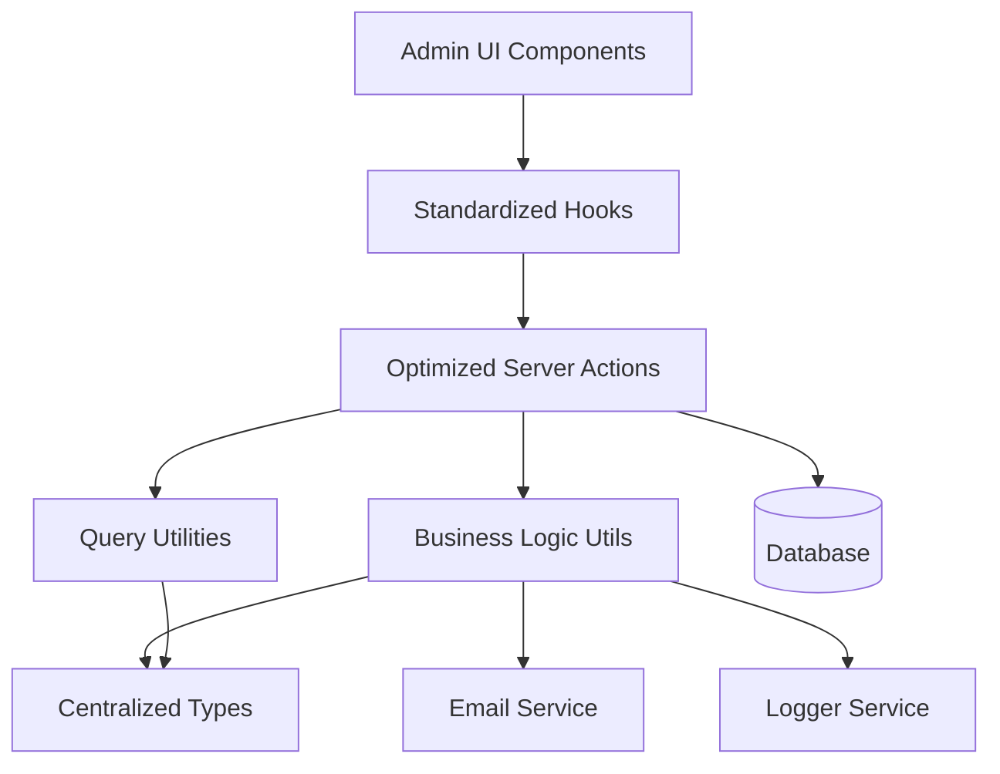
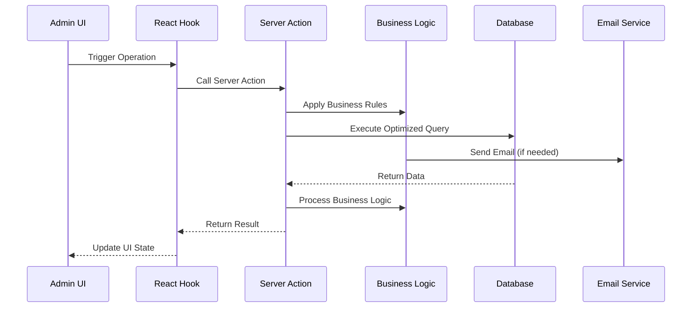

# Design Document

## Overview

This design document outlines the comprehensive improvement of the customer contact reply management system for admin users. The solution focuses on centralizing types, optimizing database operations, standardizing patterns, and improving maintainability while preserving all existing functionality.

## Architecture

### High-Level Architecture



### Data Flow Architecture



## Components and Interfaces

### 1. Centralized Type System

#### Core Types Location: `lib/types/customer-contact-replies/index.ts`

```typescript
// Base customer contact reply types
export type CustomerContactReplyBase = typeof customerContactReplies.$inferSelect;
export type CustomerContactReplyInsert = typeof customerContactReplies.$inferInsert;

// Related types
export type CustomerContactRequestBase = typeof customerContactRequests.$inferSelect;

// Comprehensive joined data types
export interface CustomerContactReplyWithDetails {
  reply: CustomerContactReplyBase;
  request: CustomerContactRequestBase | null;
}

// List view optimized type
export interface CustomerContactReplyListItem {
  id: string;
  subject: string;
  message: string;
  reply_to_email: string;
  reply_to_name: string;
  email_status: string;
  sent_at: string;
  created_at: string;
  updated_at: string;
  request: {
    id: string;
    name: string;
    email: string;
    subject: string;
  } | null;
}

// Query parameter types
export interface CustomerContactReplyQueryParams {
  page?: number;
  pageSize?: number;
  sortBy?: string;
  order?: 'asc' | 'desc';
  filters?: ColumnFiltersState;
  requestId?: string;
  status?: string;
}

// Business operation types
export interface CustomerContactReplyCreateData {
  contact_request_id: string;
  subject: string;
  message: string;
  reply_to_email: string;
  reply_to_name: string;
}

export interface CustomerContactReplyUpdateData {
  id: string;
  subject?: string;
  message?: string;
  email_status?: string;
}

// Batch reply types
export interface CustomerContactBatchReplyData {
  requestIds: string[];
  subject: string;
  message: string;
  reply_to_email: string;
  reply_to_name: string;
}
```

### 2. Optimized Server Actions

#### Structure: `lib/server-actions/admin/customer-contact-replies.ts`

```typescript
// Single comprehensive list function
export async function adminCustomerContactReplyList(params: CustomerContactReplyQueryParams): Promise<ApiResponse<{
  data: CustomerContactReplyListItem[];
  total: number;
  page: number;
  pageSize: number;
}>>

// Single comprehensive details function
export async function adminCustomerContactReplyDetails(id: string): Promise<ApiResponse<CustomerContactReplyWithDetails>>

// Optimized CRUD operations
export async function adminCustomerContactReplyCreate(data: CustomerContactReplyCreateData): Promise<ApiResponse<CustomerContactReplyBase>>
export async function adminCustomerContactReplyUpdate(data: CustomerContactReplyUpdateData): Promise<ApiResponse<CustomerContactReplyBase>>
export async function adminCustomerContactReplyDelete(id: string): Promise<ApiResponse<void>>

// Business operations
export async function adminCustomerContactReplySend(data: CustomerContactReplyCreateData): Promise<ApiResponse<CustomerContactReplyBase>>
export async function adminCustomerContactBatchReplySend(data: CustomerContactBatchReplyData): Promise<ApiResponse<CustomerContactReplyBase[]>>
export async function adminCustomerContactReplyTrack(id: string, status: string, details?: any): Promise<ApiResponse<CustomerContactReplyBase>>
```

### 3. Business Logic Utilities

#### Structure: `lib/utils/customer-contact-replies/index.ts`

```typescript
// Customer contact reply validation
export function validateCustomerContactReplyData(data: CustomerContactReplyCreateData | CustomerContactReplyUpdateData): ValidationResult

// Email handling
export async function sendCustomerContactReplyEmail(data: CustomerContactReplyCreateData): Promise<{ success: boolean; emailId?: string; error?: string }>
export async function sendCustomerContactBatchReplyEmails(data: CustomerContactBatchReplyData): Promise<{ success: boolean; replies?: CustomerContactReplyBase[]; error?: string }>

// Business rule enforcement
export function canUpdateCustomerContactReplyStatus(currentStatus: string, newStatus: string): boolean
export function validateEmailContent(subject: string, message: string): boolean
```

### 4. Standardized Hooks

#### Structure: `hooks/admin/customer-contact-replies.ts`

```typescript
// List operations
export function useAdminCustomerContactReplyList(params: CustomerContactReplyQueryParams)
export function useAdminCustomerContactReplyListByRequest(requestId: string)

// Detail operations
export function useAdminCustomerContactReplyDetails(id: string)

// Mutation operations
export function useAdminCustomerContactReplyCreate()
export function useAdminCustomerContactReplyUpdate()
export function useAdminCustomerContactReplyDelete()
export function useAdminCustomerContactReplySend()
export function useAdminCustomerContactBatchReplySend()

// Specialized operations
export function useAdminCustomerContactReplyMetrics()
export function useAdminCustomerContactReplyExport()
```

### 5. Query Optimization

#### Column Maps and Select Patterns

```typescript
// Optimized column mappings
export const customerContactReplyColumnMap = {
  id: replySchema.id,
  subject: replySchema.subject,
  reply_to_email: replySchema.reply_to_email,
  reply_to_name: replySchema.reply_to_name,
  email_status: replySchema.email_status,
  sent_at: replySchema.sent_at,
  created_at: replySchema.created_at,
  updated_at: replySchema.updated_at,
  request_name: requestSchema.name,
  request_email: requestSchema.email,
  request_subject: requestSchema.subject,
};

// Optimized select patterns
export const customerContactReplyListSelect = {
  id: replySchema.id,
  subject: replySchema.subject,
  message: replySchema.message,
  reply_to_email: replySchema.reply_to_email,
  reply_to_name: replySchema.reply_to_name,
  email_status: replySchema.email_status,
  sent_at: replySchema.sent_at,
  created_at: replySchema.created_at,
  updated_at: replySchema.updated_at,
  request: {
    id: requestSchema.id,
    name: requestSchema.name,
    email: requestSchema.email,
    subject: requestSchema.subject,
  },
};
```

## Data Models

### Database Query Patterns

#### Optimized List Query
```sql
SELECT 
  r.id, r.subject, r.message, r.reply_to_email, r.reply_to_name, r.email_status, r.sent_at, r.created_at, r.updated_at,
  cr.id as request_id, cr.name as request_name, cr.email as request_email, cr.subject as request_subject
FROM customer_contact_replies r
LEFT JOIN customer_contact_requests cr ON r.contact_request_id = cr.id
WHERE [dynamic filters]
ORDER BY [dynamic sorting]
LIMIT ? OFFSET ?
```

#### Optimized Details Query
```sql
SELECT 
  r.*,
  cr.* as request
FROM customer_contact_replies r
LEFT JOIN customer_contact_requests cr ON r.contact_request_id = cr.id
WHERE r.id = ?
```

### Caching Strategy

```typescript
// Query key structure
const customerContactReplyQueryKeys = {
  all: ['customer-contact-replies'] as const,
  lists: () => [...customerContactReplyQueryKeys.all, 'list'] as const,
  list: (params: CustomerContactReplyQueryParams) => [...customerContactReplyQueryKeys.lists(), params] as const,
  details: () => [...customerContactReplyQueryKeys.all, 'detail'] as const,
  detail: (id: string) => [...customerContactReplyQueryKeys.details(), id] as const,
  byRequest: (requestId: string) => [...customerContactReplyQueryKeys.all, 'request', requestId] as const,
  metrics: () => [...customerContactReplyQueryKeys.all, 'metrics'] as const,
};

// Cache invalidation patterns
const invalidationPatterns = {
  onReplyCreate: [customerContactReplyQueryKeys.all],
  onReplyUpdate: (id: string) => [
    customerContactReplyQueryKeys.all,
    customerContactReplyQueryKeys.detail(id)
  ],
  onReplyDelete: (id: string) => [
    customerContactReplyQueryKeys.all,
    customerContactReplyQueryKeys.detail(id)
  ],
  onBatchReplySend: [customerContactReplyQueryKeys.all],
};
```

## Error Handling

### Standardized Error Response Format

```typescript
interface ApiResponse<T> {
  success: boolean;
  data?: T;
  error?: string;
  code?: string;
  details?: Record<string, any>;
}

// Error handling utility
export function handleCustomerContactReplyError(error: unknown, operation: string): ApiResponse<never> {
  if (error instanceof ValidationError) {
    return {
      success: false,
      error: error.message,
      code: 'VALIDATION_ERROR',
      details: error.details
    };
  }
  
  if (error instanceof DatabaseError) {
    logger.error(`Customer Contact Reply ${operation} failed:`, error);
    return {
      success: false,
      error: 'Database operation failed',
      code: 'DATABASE_ERROR'
    };
  }
  
  if (error instanceof EmailError) {
    logger.error(`Email sending failed in ${operation}:`, error);
    return {
      success: false,
      error: 'Email sending failed',
      code: 'EMAIL_ERROR'
    };
  }
  
  logger.error(`Unexpected error in customer contact reply ${operation}:`, error);
  return {
    success: false,
    error: 'An unexpected error occurred',
    code: 'UNKNOWN_ERROR'
  };
}
```

### Business Rule Validation

```typescript
export class CustomerContactReplyValidationError extends Error {
  constructor(
    message: string,
    public code: string,
    public details?: Record<string, any>
  ) {
    super(message);
    this.name = 'CustomerContactReplyValidationError';
  }
}

export function validateEmailSubject(subject: string): void {
  if (subject.length < 1) {
    throw new CustomerContactReplyValidationError(
      'Subject is required',
      'SUBJECT_REQUIRED',
      { subject }
    );
  }
  
  if (subject.length > 500) {
    throw new CustomerContactReplyValidationError(
      'Subject cannot exceed 500 characters',
      'SUBJECT_TOO_LONG',
      { subject, length: subject.length }
    );
  }
}
```

## Testing Strategy

### Unit Testing Approach

```typescript
// Server action tests
describe('adminCustomerContactReplyList', () => {
  it('should return paginated customer contact reply list with proper joins');
  it('should handle filters correctly');
  it('should handle sorting correctly');
  it('should handle empty results gracefully');
});

// Business logic tests
describe('customer contact reply business logic', () => {
  it('should validate email content correctly');
  it('should handle email sending properly');
  it('should manage batch replies correctly');
});

// Hook tests
describe('customer contact reply hooks', () => {
  it('should invalidate cache correctly on mutations');
  it('should handle loading states properly');
  it('should handle error states correctly');
});
```

### Integration Testing

```typescript
// End-to-end customer contact reply flow tests
describe('customer contact reply management flow', () => {
  it('should create and send customer contact reply');
  it('should update customer contact reply details');
  it('should send batch replies to multiple requests');
  it('should track email delivery status');
  it('should maintain data consistency across operations');
});
```

## Performance Considerations

### Database Optimization
- Use proper indexes on frequently queried columns
- Implement query result caching for list operations
- Use connection pooling for concurrent requests
- Optimize JOIN operations with proper foreign key relationships

### Frontend Optimization
- Implement proper React Query caching strategies
- Use optimistic updates for better UX
- Implement virtual scrolling for large lists
- Use proper loading states and skeleton screens

### Memory Management
- Implement proper cleanup in React hooks
- Use weak references where appropriate
- Implement proper garbage collection for large datasets
- Monitor memory usage in production

## Security Considerations

### Access Control
- Implement proper role-based access control
- Validate user permissions for each operation
- Audit trail for all customer contact reply modifications
- Rate limiting for API endpoints

### Data Validation
- Server-side validation for all inputs
- SQL injection prevention through parameterized queries
- XSS prevention in user-generated content
- CSRF protection for state-changing operations

### Privacy Protection
- Proper data anonymization for exports
- Secure handling of personal information
- Compliance with data protection regulations
- Secure logging without sensitive data exposure