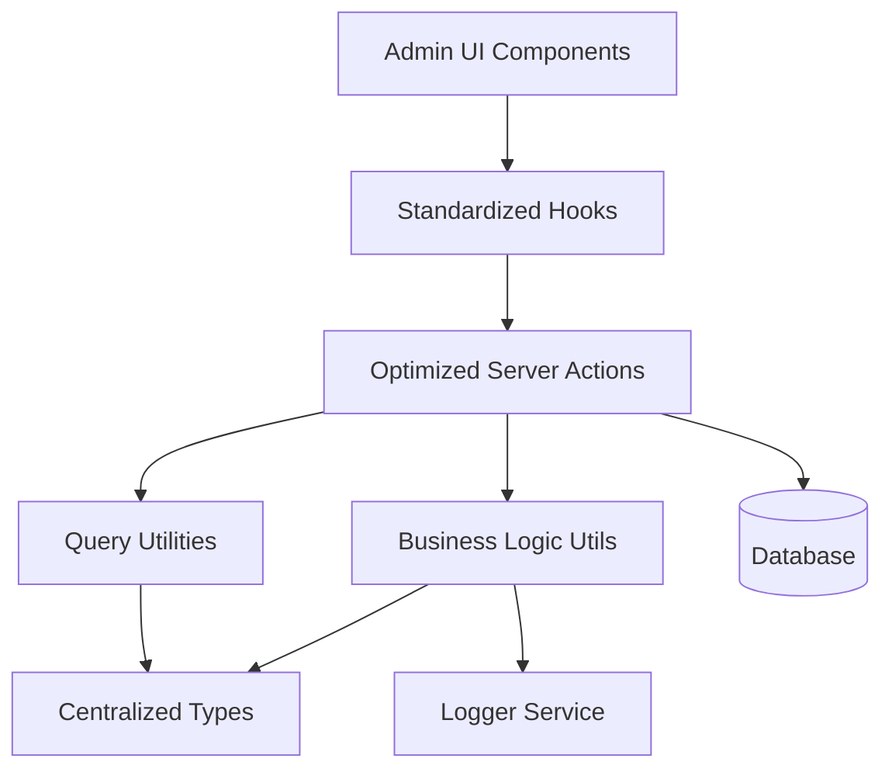
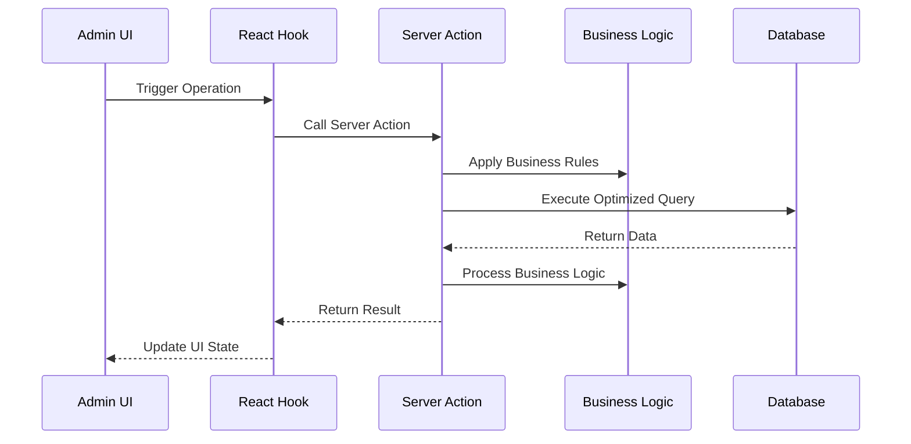

# Design Document

## Overview

This design document outlines the comprehensive improvement of the customer contact request management system for admin users. The solution focuses on centralizing types, optimizing database operations, standardizing patterns, and improving maintainability while preserving all existing functionality.

## Architecture

### High-Level Architecture



### Data Flow Architecture



## Components and Interfaces

### 1. Centralized Type System

#### Core Types Location: `lib/types/customer-contact-requests/index.ts`

```typescript
// Base customer contact request types
export type CustomerContactRequestBase = typeof customerContactRequests.$inferSelect;
export type CustomerContactRequestInsert = typeof customerContactRequests.$inferInsert;

// Related types
export type CustomerContactReplyBase = typeof customerContactReplies.$inferSelect;

// Comprehensive joined data types
export interface CustomerContactRequestWithDetails {
  request: CustomerContactRequestBase;
  replies: CustomerContactReplyBase[] | null;
}

// List view optimized type
export interface CustomerContactRequestListItem {
  id: string;
  name: string;
  email: string;
  phone: string | null;
  message: string;
  status: string;
  created_at: string;
  updated_at: string;
  reply_count: number;
  last_reply_at: string | null;
}

// Query parameter types
export interface CustomerContactRequestQueryParams {
  page?: number;
  pageSize?: number;
  sortBy?: string;
  order?: 'asc' | 'desc';
  filters?: ColumnFiltersState;
  status?: string;
  search?: string;
}

// Business operation types
export interface CustomerContactRequestCreateData {
  name: string;
  email: string;
  phone?: string;
  message: string;
  status?: string;
}

export interface CustomerContactRequestUpdateData {
  id: string;
  name?: string;
  email?: string;
  phone?: string;
  message?: string;
  status?: string;
}

// Status update types
export interface CustomerContactRequestStatusUpdate {
  id: string;
  status: string;
  notes?: string;
}
```

### 2. Optimized Server Actions

#### Structure: `lib/server-actions/admin/customer-contact-requests.ts`

```typescript
// Single comprehensive list function
export async function adminCustomerContactRequestList(params: CustomerContactRequestQueryParams): Promise<ApiResponse<{
  data: CustomerContactRequestListItem[];
  total: number;
  page: number;
  pageSize: number;
}>>

// Single comprehensive details function
export async function adminCustomerContactRequestDetails(id: string): Promise<ApiResponse<CustomerContactRequestWithDetails>>

// Optimized CRUD operations
export async function adminCustomerContactRequestCreate(data: CustomerContactRequestCreateData): Promise<ApiResponse<CustomerContactRequestBase>>
export async function adminCustomerContactRequestUpdate(data: CustomerContactRequestUpdateData): Promise<ApiResponse<CustomerContactRequestBase>>
export async function adminCustomerContactRequestDelete(id: string): Promise<ApiResponse<void>>

// Business operations
export async function adminCustomerContactRequestUpdateStatus(data: CustomerContactRequestStatusUpdate): Promise<ApiResponse<CustomerContactRequestBase>>
export async function adminCustomerContactRequestBulkUpdateStatus(requestIds: string[], status: string): Promise<ApiResponse<CustomerContactRequestBase[]>>
```

### 3. Business Logic Utilities

#### Structure: `lib/utils/customer-contact-requests/index.ts`

```typescript
// Customer contact request validation
export function validateCustomerContactRequestData(data: CustomerContactRequestCreateData | CustomerContactRequestUpdateData): ValidationResult

// Status management
export function validateCustomerContactRequestStatusTransition(from: string, to: string): boolean
export function canUpdateCustomerContactRequestStatus(userRole: string, currentStatus: string, newStatus: string): boolean

// Business rule enforcement
export function validateCustomerContactRequestFields(name: string, email: string, message: string): boolean
export function sanitizeCustomerContactRequestMessage(message: string): string
```

### 4. Standardized Hooks

#### Structure: `hooks/admin/customer-contact-requests.ts`

```typescript
// List operations
export function useAdminCustomerContactRequestList(params: CustomerContactRequestQueryParams)
export function useAdminCustomerContactRequestListByStatus(status: string)

// Detail operations
export function useAdminCustomerContactRequestDetails(id: string)

// Mutation operations
export function useAdminCustomerContactRequestCreate()
export function useAdminCustomerContactRequestUpdate()
export function useAdminCustomerContactRequestDelete()
export function useAdminCustomerContactRequestUpdateStatus()
export function useAdminCustomerContactRequestBulkUpdateStatus()

// Specialized operations
export function useAdminCustomerContactRequestMetrics()
export function useAdminCustomerContactRequestExport()
```

### 5. Query Optimization

#### Column Maps and Select Patterns

```typescript
// Optimized column mappings
export const customerContactRequestColumnMap = {
  id: requestSchema.id,
  name: requestSchema.name,
  email: requestSchema.email,
  phone: requestSchema.phone,
  message: requestSchema.message,
  status: requestSchema.status,
  created_at: requestSchema.created_at,
  updated_at: requestSchema.updated_at,
  reply_count: sql<number>`count(replies.id)`,
  last_reply_at: sql<string>`max(replies.created_at)`,
};

// Optimized select patterns
export const customerContactRequestListSelect = {
  id: requestSchema.id,
  name: requestSchema.name,
  email: requestSchema.email,
  phone: requestSchema.phone,
  message: requestSchema.message,
  status: requestSchema.status,
  created_at: requestSchema.created_at,
  updated_at: requestSchema.updated_at,
  reply_count: sql<number>`count(replies.id)`,
  last_reply_at: sql<string>`max(replies.created_at)`,
};
```

## Data Models

### Database Query Patterns

#### Optimized List Query
```sql
SELECT 
  ccr.id, ccr.name, ccr.email, ccr.phone, ccr.message, ccr.status, ccr.created_at, ccr.updated_at,
  COUNT(ccr_replies.id) as reply_count,
  MAX(ccr_replies.created_at) as last_reply_at
FROM customer_contact_requests ccr
LEFT JOIN customer_contact_replies ccr_replies ON ccr.id = ccr_replies.contact_request_id
WHERE [dynamic filters]
GROUP BY ccr.id, ccr.name, ccr.email, ccr.phone, ccr.message, ccr.status, ccr.created_at, ccr.updated_at
ORDER BY [dynamic sorting]
LIMIT ? OFFSET ?
```

#### Optimized Details Query
```sql
SELECT 
  ccr.*,
  ccr_replies.* as replies
FROM customer_contact_requests ccr
LEFT JOIN customer_contact_replies ccr_replies ON ccr.id = ccr_replies.contact_request_id
WHERE ccr.id = ?
```

### Caching Strategy

```typescript
// Query key structure
const customerContactRequestQueryKeys = {
  all: ['customer-contact-requests'] as const,
  lists: () => [...customerContactRequestQueryKeys.all, 'list'] as const,
  list: (params: CustomerContactRequestQueryParams) => [...customerContactRequestQueryKeys.lists(), params] as const,
  details: () => [...customerContactRequestQueryKeys.all, 'detail'] as const,
  detail: (id: string) => [...customerContactRequestQueryKeys.details(), id] as const,
  byStatus: (status: string) => [...customerContactRequestQueryKeys.all, 'status', status] as const,
  metrics: () => [...customerContactRequestQueryKeys.all, 'metrics'] as const,
};

// Cache invalidation patterns
const invalidationPatterns = {
  onRequestCreate: [customerContactRequestQueryKeys.all],
  onRequestUpdate: (id: string) => [
    customerContactRequestQueryKeys.all,
    customerContactRequestQueryKeys.detail(id)
  ],
  onRequestDelete: (id: string) => [
    customerContactRequestQueryKeys.all,
    customerContactRequestQueryKeys.detail(id)
  ],
  onStatusUpdate: (id: string, newStatus: string) => [
    customerContactRequestQueryKeys.all,
    customerContactRequestQueryKeys.detail(id),
    customerContactRequestQueryKeys.byStatus(newStatus)
  ],
};
```

## Error Handling

### Standardized Error Response Format

```typescript
interface ApiResponse<T> {
  success: boolean;
  data?: T;
  error?: string;
  code?: string;
  details?: Record<string, any>;
}

// Error handling utility
export function handleCustomerContactRequestError(error: unknown, operation: string): ApiResponse<never> {
  if (error instanceof ValidationError) {
    return {
      success: false,
      error: error.message,
      code: 'VALIDATION_ERROR',
      details: error.details
    };
  }
  
  if (error instanceof DatabaseError) {
    logger.error(`Customer Contact Request ${operation} failed:`, error);
    return {
      success: false,
      error: 'Database operation failed',
      code: 'DATABASE_ERROR'
    };
  }
  
  logger.error(`Unexpected error in customer contact request ${operation}:`, error);
  return {
    success: false,
    error: 'An unexpected error occurred',
    code: 'UNKNOWN_ERROR'
  };
}
```

### Business Rule Validation

```typescript
export class CustomerContactRequestValidationError extends Error {
  constructor(
    message: string,
    public code: string,
    public details?: Record<string, any>
  ) {
    super(message);
    this.name = 'CustomerContactRequestValidationError';
  }
}

export function validateCustomerContactRequestFields(name: string, email: string, message: string): void {
  if (!name || name.trim().length === 0) {
    throw new CustomerContactRequestValidationError(
      'Name is required',
      'NAME_REQUIRED',
      { name }
    );
  }
  
  if (!email || email.trim().length === 0) {
    throw new CustomerContactRequestValidationError(
      'Email is required',
      'EMAIL_REQUIRED',
      { email }
    );
  }
  
  const emailRegex = /^[^\s@]+@[^\s@]+\.[^\s@]+$/;
  if (!emailRegex.test(email)) {
    throw new CustomerContactRequestValidationError(
      'Invalid email format',
      'INVALID_EMAIL',
      { email }
    );
  }
  
  if (!message || message.trim().length === 0) {
    throw new CustomerContactRequestValidationError(
      'Message is required',
      'MESSAGE_REQUIRED',
      { message }
    );
  }
  
  if (message.length > 1000) {
    throw new CustomerContactRequestValidationError(
      'Message cannot exceed 1000 characters',
      'MESSAGE_TOO_LONG',
      { message, length: message.length }
    );
  }
}
```

## Testing Strategy

### Unit Testing Approach

```typescript
// Server action tests
describe('adminCustomerContactRequestList', () => {
  it('should return paginated customer contact request list with proper joins');
  it('should handle filters correctly');
  it('should handle sorting correctly');
  it('should handle empty results gracefully');
});

// Business logic tests
describe('customer contact request business logic', () => {
  it('should validate customer contact request fields correctly');
  it('should handle status transitions properly');
  it('should sanitize messages correctly');
});

// Hook tests
describe('customer contact request hooks', () => {
  it('should invalidate cache correctly on mutations');
  it('should handle loading states properly');
  it('should handle error states correctly');
});
```

### Integration Testing

```typescript
// End-to-end customer contact request flow tests
describe('customer contact request management flow', () => {
  it('should create customer contact request');
  it('should update customer contact request details');
  it('should update customer contact request status');
  it('should delete customer contact request');
  it('should maintain data consistency across operations');
});
```

## Performance Considerations

### Database Optimization
- Use proper indexes on frequently queried columns
- Implement query result caching for list operations
- Use connection pooling for concurrent requests
- Optimize JOIN operations with proper foreign key relationships

### Frontend Optimization
- Implement proper React Query caching strategies
- Use optimistic updates for better UX
- Implement virtual scrolling for large lists
- Use proper loading states and skeleton screens

### Memory Management
- Implement proper cleanup in React hooks
- Use weak references where appropriate
- Implement proper garbage collection for large datasets
- Monitor memory usage in production

## Security Considerations

### Access Control
- Implement proper role-based access control
- Validate user permissions for each operation
- Audit trail for all customer contact request modifications
- Rate limiting for API endpoints

### Data Validation
- Server-side validation for all inputs
- SQL injection prevention through parameterized queries
- XSS prevention in user-generated content
- CSRF protection for state-changing operations

### Privacy Protection
- Proper data anonymization for exports
- Secure handling of personal information
- Compliance with data protection regulations
- Secure logging without sensitive data exposure