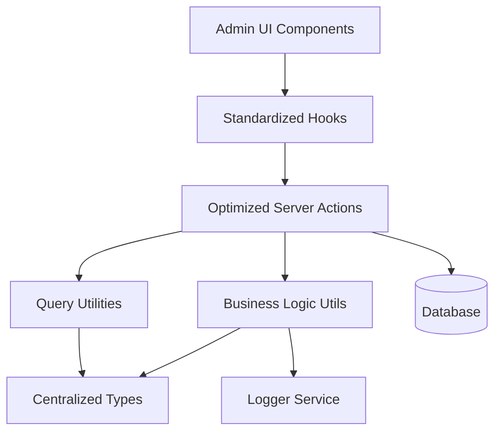
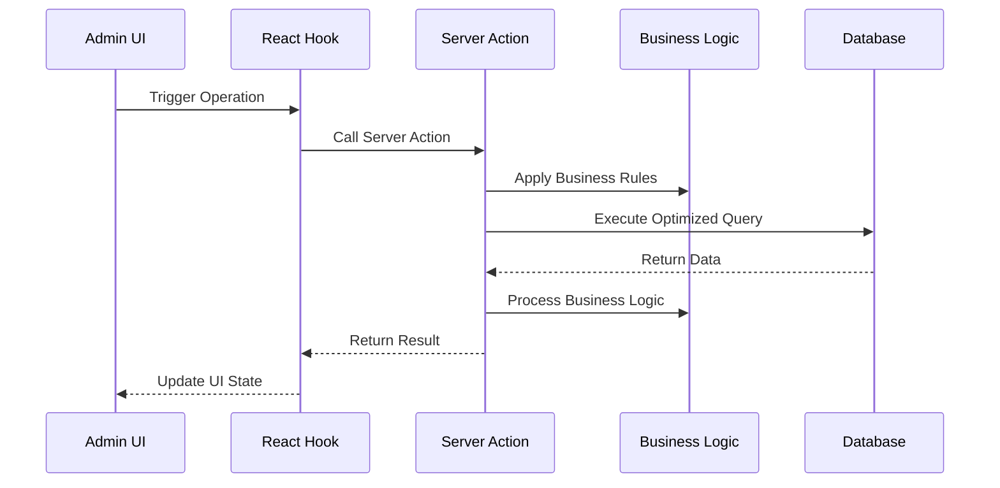

# Design Document

## Overview

This design document outlines the comprehensive improvement of the email log management system for admin users. The solution focuses on centralizing types, optimizing database operations, standardizing patterns, and improving maintainability while preserving all existing functionality.

## Architecture

### High-Level Architecture



### Data Flow Architecture



## Components and Interfaces

### 1. Centralized Type System

#### Core Types Location: `lib/types/email-logs/index.ts`

```typescript
// Base email log types
export type EmailLogBase = typeof emailLogs.$inferSelect;
export type EmailLogInsert = typeof emailLogs.$inferInsert;

// List view optimized type
export interface EmailLogListItem {
  id: string;
  resend_email_id: string | null;
  from_email: string;
  to_emails: string[];
  subject: string;
  status: string;
  email_type: string | null;
  sent_at: string;
  delivered_at: string | null;
  opened_at: string | null;
  clicked_at: string | null;
  created_at: string;
  updated_at: string;
}

// Detailed view type
export interface EmailLogDetails {
  id: string;
  resend_email_id: string | null;
  batch_id: string | null;
  from_email: string;
  to_emails: string[];
  subject: string;
  html_content: string | null;
  text_content: string | null;
  reply_to: string | null;
  status: string;
  email_type: string | null;
  template_used: string | null;
  resend_response: any | null;
  error_message: string | null;
  sent_at: string;
  delivered_at: string | null;
  opened_at: string | null;
  clicked_at: string | null;
  user_id: string | null;
  admin_id: string | null;
  related_entity_type: string | null;
  related_entity_id: string | null;
  created_at: string;
  updated_at: string;
}

// Query parameter types
export interface EmailLogQueryParams {
  page?: number;
  pageSize?: number;
  sortBy?: string;
  order?: 'asc' | 'desc';
  filters?: ColumnFiltersState;
  status?: string;
  emailType?: string;
  search?: string;
  dateFrom?: string;
  dateTo?: string;
}

// Business operation types
export interface EmailLogCreateData {
  resend_email_id?: string;
  batch_id?: string;
  from_email: string;
  to_emails: string[];
  subject: string;
  html_content?: string;
  text_content?: string;
  reply_to?: string;
  email_type?: string;
  template_used?: string;
  resend_response?: any;
  error_message?: string;
  user_id?: string;
  admin_id?: string;
  related_entity_type?: string;
  related_entity_id?: string;
}

export interface EmailLogUpdateData {
  id: string;
  status?: string;
  delivered_at?: string;
  opened_at?: string;
  clicked_at?: string;
  error_message?: string;
}

// Statistics types
export interface EmailLogStats {
  statusBreakdown: {
    status: string;
    count: number;
  }[];
  totalEmails: number;
  recentEmails: number;
  emailTypes: {
    type: string;
    count: number;
  }[];
}
```

### 2. Optimized Server Actions

#### Structure: `lib/server-actions/admin/email-logs.ts`

```typescript
// Single comprehensive list function
export async function adminEmailLogList(params: EmailLogQueryParams): Promise<ApiResponse<{
  data: EmailLogListItem[];
  total: number;
  page: number;
  pageSize: number;
  totalPages: number;
}>>

// Single comprehensive details function
export async function adminEmailLogDetails(id: string): Promise<ApiResponse<EmailLogDetails>>

// Optimized CRUD operations
export async function adminEmailLogCreate(data: EmailLogCreateData): Promise<ApiResponse<EmailLogBase>>
export async function adminEmailLogUpdate(data: EmailLogUpdateData): Promise<ApiResponse<EmailLogBase>>
export async function adminEmailLogDelete(id: string): Promise<ApiResponse<void>>

// Business operations
export async function adminEmailLogUpdateStatus(data: EmailLogUpdateData): Promise<ApiResponse<EmailLogBase>>
export async function adminEmailLogBulkUpdateStatus(emailLogIds: string[], status: string): Promise<ApiResponse<EmailLogBase[]>>
export async function adminEmailLogStats(): Promise<ApiResponse<EmailLogStats>>
```

### 3. Business Logic Utilities

#### Structure: `lib/utils/email-logs/index.ts`

```typescript
// Email log validation
export function validateEmailLogData(data: EmailLogCreateData | EmailLogUpdateData): ValidationResult

// Status management
export function validateEmailLogStatusTransition(from: string, to: string): boolean
export function canUpdateEmailLogStatus(userRole: string, currentStatus: string, newStatus: string): boolean

// Business rule enforcement
export function validateEmailLogFields(fromEmail: string, toEmails: string[], subject: string): boolean
export function sanitizeEmailContent(content: string): string
```

### 4. Standardized Hooks

#### Structure: `hooks/admin/email-logs.ts`

```typescript
// List operations
export function useAdminEmailLogList(params: EmailLogQueryParams)
export function useAdminEmailLogListByStatus(status: string)
export function useAdminEmailLogListByType(emailType: string)

// Detail operations
export function useAdminEmailLogDetails(id: string)

// Mutation operations
export function useAdminEmailLogCreate()
export function useAdminEmailLogUpdate()
export function useAdminEmailLogDelete()
export function useAdminEmailLogUpdateStatus()
export function useAdminEmailLogBulkUpdateStatus()

// Statistics operations
export function useAdminEmailLogStats()

// Specialized operations
export function useAdminEmailLogMetrics()
export function useAdminEmailLogExport()
```

### 5. Query Optimization

#### Column Maps and Select Patterns

```typescript
// Optimized column mappings
export const emailLogColumnMap = {
  id: emailLogSchema.id,
  resend_email_id: emailLogSchema.resend_email_id,
  from_email: emailLogSchema.from_email,
  subject: emailLogSchema.subject,
  status: emailLogSchema.status,
  email_type: emailLogSchema.email_type,
  sent_at: emailLogSchema.sent_at,
  delivered_at: emailLogSchema.delivered_at,
  opened_at: emailLogSchema.opened_at,
  clicked_at: emailLogSchema.clicked_at,
  created_at: emailLogSchema.created_at,
  updated_at: emailLogSchema.updated_at,
};

// Optimized select patterns
export const emailLogListSelect = {
  id: emailLogSchema.id,
  resend_email_id: emailLogSchema.resend_email_id,
  from_email: emailLogSchema.from_email,
  to_emails: emailLogSchema.to_emails,
  subject: emailLogSchema.subject,
  status: emailLogSchema.status,
  email_type: emailLogSchema.email_type,
  sent_at: emailLogSchema.sent_at,
  delivered_at: emailLogSchema.delivered_at,
  opened_at: emailLogSchema.opened_at,
  clicked_at: emailLogSchema.clicked_at,
  created_at: emailLogSchema.created_at,
  updated_at: emailLogSchema.updated_at,
};
```

## Data Models

### Database Query Patterns

#### Optimized List Query
```sql
SELECT 
  el.id, el.resend_email_id, el.from_email, el.to_emails, el.subject, el.status, el.email_type, 
  el.sent_at, el.delivered_at, el.opened_at, el.clicked_at, el.created_at, el.updated_at
FROM email_logs el
WHERE [dynamic filters]
ORDER BY [dynamic sorting]
LIMIT ? OFFSET ?
```

#### Optimized Details Query
```sql
SELECT 
  el.*
FROM email_logs el
WHERE el.id = ?
```

### Caching Strategy

```typescript
// Query key structure
const emailLogQueryKeys = {
  all: ['email-logs'] as const,
  lists: () => [...emailLogQueryKeys.all, 'list'] as const,
  list: (params: EmailLogQueryParams) => [...emailLogQueryKeys.lists(), params] as const,
  details: () => [...emailLogQueryKeys.all, 'detail'] as const,
  detail: (id: string) => [...emailLogQueryKeys.details(), id] as const,
  byStatus: (status: string) => [...emailLogQueryKeys.all, 'status', status] as const,
  byType: (emailType: string) => [...emailLogQueryKeys.all, 'type', emailType] as const,
  stats: () => [...emailLogQueryKeys.all, 'stats'] as const,
};

// Cache invalidation patterns
const invalidationPatterns = {
  onLogCreate: [emailLogQueryKeys.all],
  onLogUpdate: (id: string) => [
    emailLogQueryKeys.all,
    emailLogQueryKeys.detail(id)
  ],
  onLogDelete: (id: string) => [
    emailLogQueryKeys.all,
    emailLogQueryKeys.detail(id)
  ],
  onStatusUpdate: (id: string, newStatus: string) => [
    emailLogQueryKeys.all,
    emailLogQueryKeys.detail(id),
    emailLogQueryKeys.byStatus(newStatus)
  ],
  onStatsUpdate: [emailLogQueryKeys.stats()],
};
```

## Error Handling

### Standardized Error Response Format

```typescript
interface ApiResponse<T> {
  success: boolean;
  data?: T;
  error?: string;
  code?: string;
  details?: Record<string, any>;
}

// Error handling utility
export function handleEmailLogError(error: unknown, operation: string): ApiResponse<never> {
  if (error instanceof ValidationError) {
    return {
      success: false,
      error: error.message,
      code: 'VALIDATION_ERROR',
      details: error.details
    };
  }
  
  if (error instanceof DatabaseError) {
    logger.error(`Email Log ${operation} failed:`, error);
    return {
      success: false,
      error: 'Database operation failed',
      code: 'DATABASE_ERROR'
    };
  }
  
  logger.error(`Unexpected error in email log ${operation}:`, error);
  return {
    success: false,
    error: 'An unexpected error occurred',
    code: 'UNKNOWN_ERROR'
  };
}
```

### Business Rule Validation

```typescript
export class EmailLogValidationError extends Error {
  constructor(
    message: string,
    public code: string,
    public details?: Record<string, any>
  ) {
    super(message);
    this.name = 'EmailLogValidationError';
  }
}

export function validateEmailLogFields(fromEmail: string, toEmails: string[], subject: string): void {
  if (!fromEmail || fromEmail.trim().length === 0) {
    throw new EmailLogValidationError(
      'From email is required',
      'FROM_EMAIL_REQUIRED',
      { fromEmail }
    );
  }
  
  const emailRegex = /^[^\s@]+@[^\s@]+\.[^\s@]+$/;
  if (!emailRegex.test(fromEmail)) {
    throw new EmailLogValidationError(
      'Invalid from email format',
      'INVALID_FROM_EMAIL',
      { fromEmail }
    );
  }
  
  if (!toEmails || toEmails.length === 0) {
    throw new EmailLogValidationError(
      'At least one recipient email is required',
      'RECIPIENT_EMAILS_REQUIRED',
      { toEmails }
    );
  }
  
  for (const email of toEmails) {
    if (!emailRegex.test(email)) {
      throw new EmailLogValidationError(
        `Invalid recipient email format: ${email}`,
        'INVALID_RECIPIENT_EMAIL',
        { email }
      );
    }
  }
  
  if (!subject || subject.trim().length === 0) {
    throw new EmailLogValidationError(
      'Subject is required',
      'SUBJECT_REQUIRED',
      { subject }
    );
  }
  
  if (subject.length > 500) {
    throw new EmailLogValidationError(
      'Subject cannot exceed 500 characters',
      'SUBJECT_TOO_LONG',
      { subject, length: subject.length }
    );
  }
}
```

## Testing Strategy

### Unit Testing Approach

```typescript
// Server action tests
describe('adminEmailLogList', () => {
  it('should return paginated email log list with proper joins');
  it('should handle filters correctly');
  it('should handle sorting correctly');
  it('should handle empty results gracefully');
});

// Business logic tests
describe('email log business logic', () => {
  it('should validate email log fields correctly');
  it('should handle status transitions properly');
  it('should sanitize email content correctly');
});

// Hook tests
describe('email log hooks', () => {
  it('should invalidate cache correctly on mutations');
  it('should handle loading states properly');
  it('should handle error states correctly');
});
```

### Integration Testing

```typescript
// End-to-end email log flow tests
describe('email log management flow', () => {
  it('should create email log entry');
  it('should update email log details');
  it('should update email log status');
  it('should delete email log entry');
  it('should maintain data consistency across operations');
});
```

## Performance Considerations

### Database Optimization
- Use proper indexes on frequently queried columns
- Implement query result caching for list operations
- Use connection pooling for concurrent requests
- Optimize JOIN operations with proper foreign key relationships

### Frontend Optimization
- Implement proper React Query caching strategies
- Use optimistic updates for better UX
- Implement virtual scrolling for large lists
- Use proper loading states and skeleton screens

### Memory Management
- Implement proper cleanup in React hooks
- Use weak references where appropriate
- Implement proper garbage collection for large datasets
- Monitor memory usage in production

## Security Considerations

### Access Control
- Implement proper role-based access control
- Validate user permissions for each operation
- Audit trail for all email log modifications
- Rate limiting for API endpoints

### Data Validation
- Server-side validation for all inputs
- SQL injection prevention through parameterized queries
- XSS prevention in user-generated content
- CSRF protection for state-changing operations

### Privacy Protection
- Proper data anonymization for exports
- Secure handling of personal information
- Compliance with data protection regulations
- Secure logging without sensitive data exposure