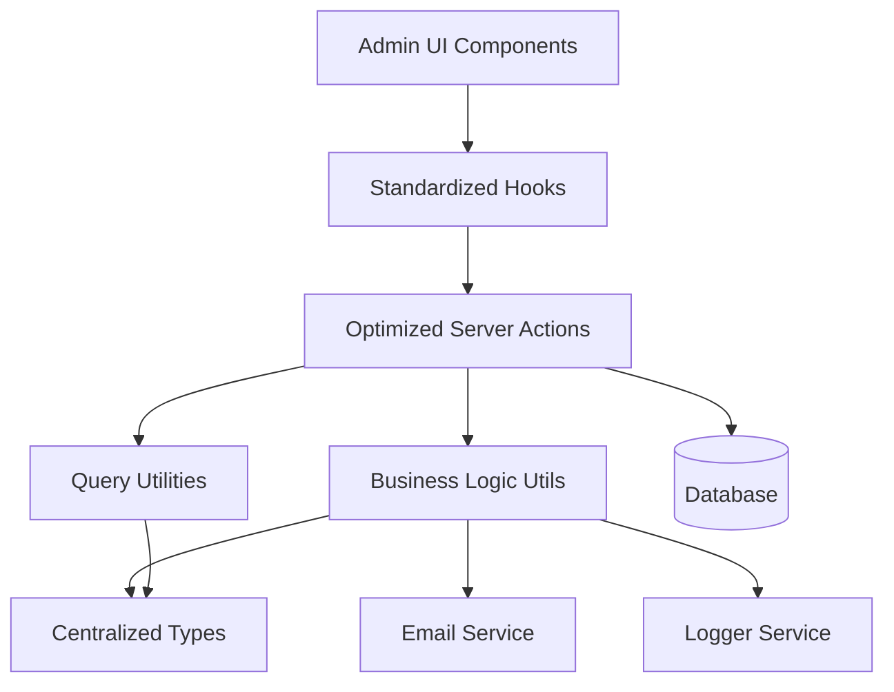
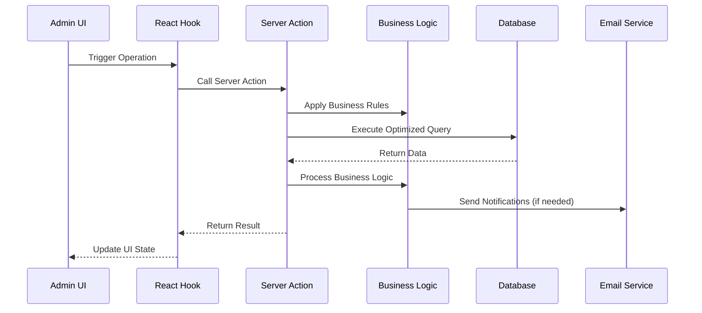

# Design Document

## Overview

This design document outlines the comprehensive improvement of the enrollment management system for admin users. The solution focuses on centralizing types, optimizing database operations, standardizing patterns, and improving maintainability while preserving all existing functionality.

## Architecture

### High-Level Architecture



### Data Flow Architecture



## Components and Interfaces

### 1. Centralized Type System

#### Core Types Location: `lib/db/drizzle-zod-schema/enrollments.ts`

```typescript
// Base enrollment types
export type EnrollmentBase = typeof enrollments.$inferSelect;
export type EnrollmentInsert = typeof enrollments.$inferInsert;

// Comprehensive joined data types
export interface EnrollmentWithDetails {
  enrollment: EnrollmentBase;
  user: UserProfile | null;
  intake: IntakeDetails | null;
  course: CourseDetails | null;
  category: CategoryDetails | null;
  payment: PaymentDetails | null;
}

// List view optimized type
export interface EnrollmentListItem {
  id: string;
  status: EnrollmentStatus;
  created_at: string;
  user: {
    id: string;
    fullName: string;
    email: string;
  };
  course: {
    id: string;
    title: string;
    price: number;
  };
  intake: {
    id: string;
    start_date: string;
    end_date: string;
  };
  payment: {
    id: string | null;
    status: PaymentStatus | null;
    amount: number | null;
  };
}

// Query parameter types
export interface EnrollmentQueryParams {
  page?: number;
  pageSize?: number;
  sortBy?: string;
  order?: 'asc' | 'desc';
  filters?: ColumnFiltersState;
  status?: EnrollmentStatus;
  userId?: string;
}

// Business operation types
export interface EnrollmentStatusUpdate {
  id: string;
  status: EnrollmentStatus;
  cancelled_reason?: string;
  notify_user?: boolean;
}

export interface EnrollmentCreateData {
  user_id: string;
  intake_id: string;
  status?: EnrollmentStatus;
  notes?: string;
}
```

### 2. Optimized Server Actions

#### Structure: `lib/server-actions/admin/enrollments.ts`

```typescript
// Single comprehensive list function
export async function adminEnrollmentList(params: EnrollmentQueryParams): Promise<ApiResponse<{
  data: EnrollmentListItem[];
  total: number;
  page: number;
  pageSize: number;
}>>

// Single comprehensive details function
export async function adminEnrollmentDetails(id: string): Promise<ApiResponse<EnrollmentWithDetails>>

// Optimized CRUD operations
export async function adminEnrollmentCreate(data: EnrollmentCreateData): Promise<ApiResponse<EnrollmentBase>>
export async function adminEnrollmentUpdate(id: string, data: Partial<EnrollmentInsert>): Promise<ApiResponse<EnrollmentBase>>
export async function adminEnrollmentDelete(id: string): Promise<ApiResponse<void>>

// Business operations
export async function adminEnrollmentUpdateStatus(update: EnrollmentStatusUpdate): Promise<ApiResponse<EnrollmentBase>>
export async function adminEnrollmentBulkStatusUpdate(updates: EnrollmentStatusUpdate[]): Promise<ApiResponse<EnrollmentBase[]>>
```

### 3. Business Logic Utilities

#### Structure: `lib/utils/enrollment-business-logic.ts`

```typescript
// Email notification handling
export async function handleEnrollmentStatusNotification(
  enrollment: EnrollmentWithDetails,
  previousStatus: EnrollmentStatus,
  newStatus: EnrollmentStatus,
  reason?: string
): Promise<void>

// Enrollment validation
export function validateEnrollmentOperation(
  operation: 'create' | 'update' | 'delete',
  data: any,
  existing?: EnrollmentWithDetails
): ValidationResult

// Business rule enforcement
export function canUpdateEnrollmentStatus(
  currentStatus: EnrollmentStatus,
  newStatus: EnrollmentStatus,
  userRole: string
): boolean

// Intake capacity management
export async function updateIntakeCapacity(
  intakeId: string,
  operation: 'increment' | 'decrement'
): Promise<void>

// Payment synchronization
export async function syncEnrollmentPaymentStatus(
  enrollmentId: string,
  enrollmentStatus: EnrollmentStatus
): Promise<void>
```

### 4. Standardized Hooks

#### Structure: `hooks/admin/enrollments.ts`

```typescript
// List operations
export function useAdminEnrollmentList(params: EnrollmentQueryParams)
export function useAdminEnrollmentListByStatus(status: EnrollmentStatus)
export function useAdminEnrollmentListByUser(userId: string)

// Detail operations
export function useAdminEnrollmentDetails(id: string)

// Mutation operations
export function useAdminEnrollmentCreate()
export function useAdminEnrollmentUpdate()
export function useAdminEnrollmentDelete()
export function useAdminEnrollmentStatusUpdate()
export function useAdminEnrollmentBulkStatusUpdate()

// Specialized operations
export function useAdminEnrollmentMetrics()
export function useAdminEnrollmentExport()
```

### 5. Query Optimization

#### Column Maps and Select Patterns

```typescript
// Optimized column mappings
export const enrollmentColumnMap = {
  id: enrollmentSchema.id,
  status: enrollmentSchema.status,
  created_at: enrollmentSchema.created_at,
  user_name: profileSchema.full_name,
  user_email: profileSchema.email,
  course_title: courseSchema.title,
  course_price: courseSchema.price,
  intake_start: intakeSchema.start_date,
  payment_status: paymentSchema.status,
};

// Optimized select patterns
export const enrollmentListSelect = {
  id: enrollmentSchema.id,
  status: enrollmentSchema.status,
  created_at: enrollmentSchema.created_at,
  notes: enrollmentSchema.notes,
  user: {
    id: profileSchema.id,
    fullName: profileSchema.full_name,
    email: profileSchema.email,
  },
  course: {
    id: courseSchema.id,
    title: courseSchema.title,
    price: courseSchema.price,
  },
  intake: {
    id: intakeSchema.id,
    start_date: intakeSchema.start_date,
    end_date: intakeSchema.end_date,
  },
  payment: {
    id: paymentSchema.id,
    status: paymentSchema.status,
    amount: paymentSchema.amount,
  },
};
```

## Data Models

### Database Query Patterns

#### Optimized List Query
```sql
SELECT 
  e.id, e.status, e.created_at, e.notes,
  p.id as user_id, p.full_name, p.email,
  c.id as course_id, c.title as course_title, c.price,
  i.id as intake_id, i.start_date, i.end_date,
  pay.id as payment_id, pay.status as payment_status, pay.amount
FROM enrollments e
LEFT JOIN profiles p ON e.user_id = p.id
LEFT JOIN intakes i ON e.intake_id = i.id
LEFT JOIN courses c ON i.course_id = c.id
LEFT JOIN payments pay ON pay.enrollment_id = e.id
WHERE [dynamic filters]
ORDER BY [dynamic sorting]
LIMIT ? OFFSET ?
```

#### Optimized Details Query
```sql
SELECT 
  e.*,
  p.* as user_profile,
  i.* as intake_details,
  c.* as course_details,
  cat.* as category_details,
  pay.* as payment_details
FROM enrollments e
LEFT JOIN profiles p ON e.user_id = p.id
LEFT JOIN intakes i ON e.intake_id = i.id
LEFT JOIN courses c ON i.course_id = c.id
LEFT JOIN course_categories cat ON c.category_id = cat.id
LEFT JOIN payments pay ON pay.enrollment_id = e.id
WHERE e.id = ?
```

### Caching Strategy

```typescript
// Query key structure
const enrollmentQueryKeys = {
  all: ['enrollments'] as const,
  lists: () => [...enrollmentQueryKeys.all, 'list'] as const,
  list: (params: EnrollmentQueryParams) => [...enrollmentQueryKeys.lists(), params] as const,
  details: () => [...enrollmentQueryKeys.all, 'detail'] as const,
  detail: (id: string) => [...enrollmentQueryKeys.details(), id] as const,
  byUser: (userId: string) => [...enrollmentQueryKeys.all, 'user', userId] as const,
  byStatus: (status: EnrollmentStatus) => [...enrollmentQueryKeys.all, 'status', status] as const,
  metrics: () => [...enrollmentQueryKeys.all, 'metrics'] as const,
};

// Cache invalidation patterns
const invalidationPatterns = {
  onEnrollmentCreate: [enrollmentQueryKeys.all],
  onEnrollmentUpdate: (id: string) => [
    enrollmentQueryKeys.all,
    enrollmentQueryKeys.detail(id)
  ],
  onEnrollmentDelete: (id: string) => [
    enrollmentQueryKeys.all,
    enrollmentQueryKeys.detail(id)
  ],
  onStatusUpdate: (id: string, userId: string, status: EnrollmentStatus) => [
    enrollmentQueryKeys.all,
    enrollmentQueryKeys.detail(id),
    enrollmentQueryKeys.byUser(userId),
    enrollmentQueryKeys.byStatus(status)
  ],
};
```

## Error Handling

### Standardized Error Response Format

```typescript
interface ApiResponse<T> {
  success: boolean;
  data?: T;
  error?: string;
  code?: string;
  details?: Record<string, any>;
}

// Error handling utility
export function handleEnrollmentError(error: unknown, operation: string): ApiResponse<never> {
  if (error instanceof ValidationError) {
    return {
      success: false,
      error: error.message,
      code: 'VALIDATION_ERROR',
      details: error.details
    };
  }
  
  if (error instanceof DatabaseError) {
    logger.error(`Enrollment ${operation} failed:`, error);
    return {
      success: false,
      error: 'Database operation failed',
      code: 'DATABASE_ERROR'
    };
  }
  
  logger.error(`Unexpected error in enrollment ${operation}:`, error);
  return {
    success: false,
    error: 'An unexpected error occurred',
    code: 'UNKNOWN_ERROR'
  };
}
```

### Business Rule Validation

```typescript
export class EnrollmentValidationError extends Error {
  constructor(
    message: string,
    public code: string,
    public details?: Record<string, any>
  ) {
    super(message);
    this.name = 'EnrollmentValidationError';
  }
}

export function validateEnrollmentStatusTransition(
  from: EnrollmentStatus,
  to: EnrollmentStatus
): void {
  const validTransitions: Record<EnrollmentStatus, EnrollmentStatus[]> = {
    requested: ['enrolled', 'cancelled'],
    enrolled: ['completed', 'cancelled'],
    completed: [], // No transitions from completed
    cancelled: ['requested'], // Allow re-enrollment
  };
  
  if (!validTransitions[from]?.includes(to)) {
    throw new EnrollmentValidationError(
      `Invalid status transition from ${from} to ${to}`,
      'INVALID_STATUS_TRANSITION',
      { from, to, validTransitions: validTransitions[from] }
    );
  }
}
```

## Testing Strategy

### Unit Testing Approach

```typescript
// Server action tests
describe('adminEnrollmentList', () => {
  it('should return paginated enrollment list with proper joins');
  it('should handle filters correctly');
  it('should handle sorting correctly');
  it('should handle empty results gracefully');
});

// Business logic tests
describe('enrollment business logic', () => {
  it('should validate status transitions correctly');
  it('should handle capacity updates properly');
  it('should send appropriate notifications');
});

// Hook tests
describe('enrollment hooks', () => {
  it('should invalidate cache correctly on mutations');
  it('should handle loading states properly');
  it('should handle error states correctly');
});
```

### Integration Testing

```typescript
// End-to-end enrollment flow tests
describe('enrollment management flow', () => {
  it('should create enrollment with payment and update capacity');
  it('should update status and send notifications');
  it('should handle concurrent enrollment attempts');
  it('should maintain data consistency across operations');
});
```

## Performance Considerations

### Database Optimization
- Use proper indexes on frequently queried columns
- Implement query result caching for list operations
- Use connection pooling for concurrent requests
- Optimize JOIN operations with proper foreign key relationships

### Frontend Optimization
- Implement proper React Query caching strategies
- Use optimistic updates for better UX
- Implement virtual scrolling for large lists
- Use proper loading states and skeleton screens

### Memory Management
- Implement proper cleanup in React hooks
- Use weak references where appropriate
- Implement proper garbage collection for large datasets
- Monitor memory usage in production

## Security Considerations

### Access Control
- Implement proper role-based access control
- Validate user permissions for each operation
- Audit trail for all enrollment modifications
- Rate limiting for API endpoints

### Data Validation
- Server-side validation for all inputs
- SQL injection prevention through parameterized queries
- XSS prevention in user-generated content
- CSRF protection for state-changing operations

### Privacy Protection
- Proper data anonymization for exports
- Secure handling of personal information
- Compliance with data protection regulations
- Secure logging without sensitive data exposure