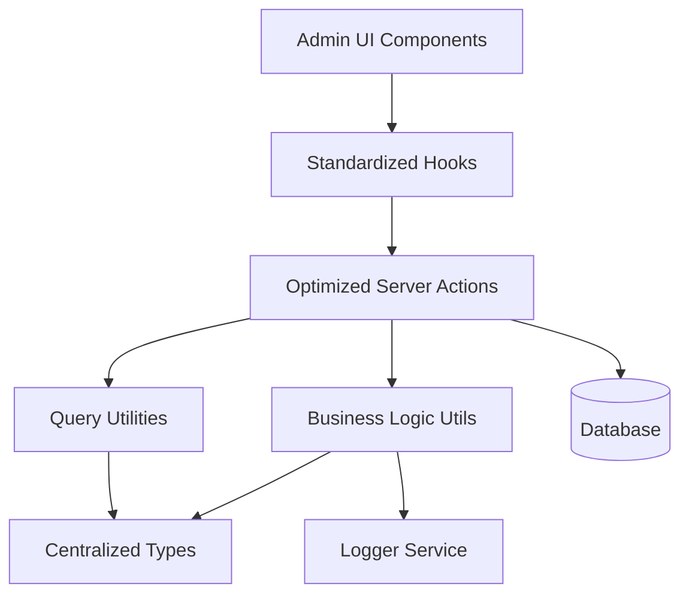
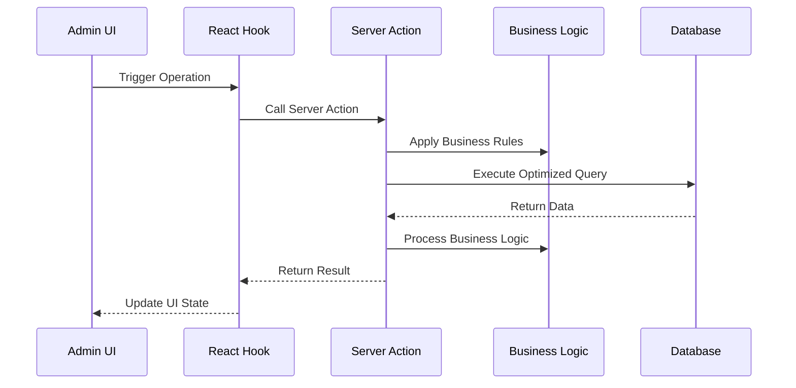

# Design Document

## Overview

This design document outlines the comprehensive improvement of the intake management system for admin users. The solution focuses on centralizing types, optimizing database operations, standardizing patterns, and improving maintainability while preserving all existing functionality.

## Architecture

### High-Level Architecture



### Data Flow Architecture



## Components and Interfaces

### 1. Centralized Type System

#### Core Types Location: `lib/types/intakes/index.ts`

```typescript
// Base intake types
export type IntakeBase = typeof intakes.$inferSelect;
export type IntakeInsert = typeof intakes.$inferInsert;

// Related types
export type CourseBase = typeof courses.$inferSelect;
export type EnrollmentBase = typeof enrollments.$inferSelect;

// Comprehensive joined data types
export interface IntakeWithDetails {
  intake: IntakeBase;
  course: CourseBase | null;
  enrollments: EnrollmentBase[] | null;
}

// List view optimized type
export interface IntakeListItem {
  id: string;
  start_date: string;
  end_date: string;
  capacity: number;
  is_open: boolean;
  total_registered: number;
  created_at: string;
  updated_at: string;
  course: {
    id: string;
    title: string;
    price: number;
  } | null;
  enrollment_count: number;
  available_spots: number;
}

// Query parameter types
export interface IntakeQueryParams {
  page?: number;
  pageSize?: number;
  sortBy?: string;
  order?: 'asc' | 'desc';
  filters?: ColumnFiltersState;
  courseId?: string;
  status?: 'open' | 'closed' | 'full';
}

// Business operation types
export interface IntakeCreateData {
  course_id: string;
  start_date: string;
  end_date: string;
  capacity: number;
  is_open?: boolean;
}

export interface IntakeUpdateData {
  id: string;
  course_id: string;
  start_date: string;
  end_date: string;
  capacity: number;
  is_open?: boolean;
}
```

### 2. Optimized Server Actions

#### Structure: `lib/server-actions/admin/intakes.ts`

```typescript
// Single comprehensive list function
export async function adminIntakeList(params: IntakeQueryParams): Promise<ApiResponse<{
  data: IntakeListItem[];
  total: number;
  page: number;
  pageSize: number;
}>>

// Single comprehensive details function
export async function adminIntakeDetails(id: string): Promise<ApiResponse<IntakeWithDetails>>

// Optimized CRUD operations
export async function adminIntakeCreate(data: IntakeCreateData): Promise<ApiResponse<IntakeBase>>
export async function adminIntakeUpdate(data: IntakeUpdateData): Promise<ApiResponse<IntakeBase>>
export async function adminIntakeDelete(id: string): Promise<ApiResponse<void>>

// Business operations
export async function adminIntakeCheckConstraints(id: string): Promise<ApiResponse<{ canDelete: boolean; enrollmentCount: number }>>
export async function adminIntakeToggleStatus(id: string, isOpen: boolean): Promise<ApiResponse<IntakeBase>>
```

### 3. Business Logic Utilities

#### Structure: `lib/utils/intakes/index.ts`

```typescript
// Intake validation
export function validateIntakeData(data: IntakeCreateData | IntakeUpdateData): ValidationResult

// Constraint checking
export async function checkIntakeConstraints(id: string): Promise<{ canDelete: boolean; enrollmentCount: number }>

// Business rule enforcement
export function validateIntakeDates(startDate: string, endDate: string): boolean
export function validateIntakeCapacity(capacity: number): boolean
export function calculateAvailableSpots(capacity: number, registered: number): number
```

### 4. Standardized Hooks

#### Structure: `hooks/admin/intakes.ts`

```typescript
// List operations
export function useAdminIntakeList(params: IntakeQueryParams)
export function useAdminIntakeListByCourse(courseId: string)

// Detail operations
export function useAdminIntakeDetails(id: string)

// Mutation operations
export function useAdminIntakeCreate()
export function useAdminIntakeUpdate()
export function useAdminIntakeDelete()
export function useAdminIntakeConstraintCheck()
export function useAdminIntakeToggleStatus()

// Specialized operations
export function useAdminIntakeMetrics()
export function useAdminIntakeExport()
```

### 5. Query Optimization

#### Column Maps and Select Patterns

```typescript
// Optimized column mappings
export const intakeColumnMap = {
  id: intakeSchema.id,
  start_date: intakeSchema.start_date,
  end_date: intakeSchema.end_date,
  capacity: intakeSchema.capacity,
  is_open: intakeSchema.is_open,
  total_registered: intakeSchema.total_registered,
  created_at: intakeSchema.created_at,
  updated_at: intakeSchema.updated_at,
  course_title: courseSchema.title,
  course_price: courseSchema.price,
  enrollment_count: sql<number>`count(enrollments.id)`,
  available_spots: sql<number>`(${intakeSchema.capacity} - ${intakeSchema.total_registered})`,
};

// Optimized select patterns
export const intakeListSelect = {
  id: intakeSchema.id,
  start_date: intakeSchema.start_date,
  end_date: intakeSchema.end_date,
  capacity: intakeSchema.capacity,
  is_open: intakeSchema.is_open,
  total_registered: intakeSchema.total_registered,
  created_at: intakeSchema.created_at,
  updated_at: intakeSchema.updated_at,
  course: {
    id: courseSchema.id,
    title: courseSchema.title,
    price: courseSchema.price,
  },
  enrollment_count: sql<number>`count(enrollments.id)`,
  available_spots: sql<number>`(${intakeSchema.capacity} - ${intakeSchema.total_registered})`,
};
```

## Data Models

### Database Query Patterns

#### Optimized List Query
```sql
SELECT 
  i.id, i.start_date, i.end_date, i.capacity, i.is_open, i.total_registered, i.created_at, i.updated_at,
  c.id as course_id, c.title as course_title, c.price as course_price,
  COUNT(e.id) as enrollment_count,
  (i.capacity - i.total_registered) as available_spots
FROM intakes i
LEFT JOIN courses c ON i.course_id = c.id
LEFT JOIN enrollments e ON i.id = e.intake_id
WHERE [dynamic filters]
GROUP BY i.id, i.start_date, i.end_date, i.capacity, i.is_open, i.total_registered, i.created_at, i.updated_at, c.id, c.title, c.price
ORDER BY [dynamic sorting]
LIMIT ? OFFSET ?
```

#### Optimized Details Query
```sql
SELECT 
  i.*,
  c.* as course,
  e.* as enrollments
FROM intakes i
LEFT JOIN courses c ON i.course_id = c.id
LEFT JOIN enrollments e ON i.id = e.intake_id
WHERE i.id = ?
```

### Caching Strategy

```typescript
// Query key structure
const intakeQueryKeys = {
  all: ['intakes'] as const,
  lists: () => [...intakeQueryKeys.all, 'list'] as const,
  list: (params: IntakeQueryParams) => [...intakeQueryKeys.lists(), params] as const,
  details: () => [...intakeQueryKeys.all, 'detail'] as const,
  detail: (id: string) => [...intakeQueryKeys.details(), id] as const,
  byCourse: (courseId: string) => [...intakeQueryKeys.all, 'course', courseId] as const,
  open: () => [...intakeQueryKeys.all, 'open'] as const,
  metrics: () => [...intakeQueryKeys.all, 'metrics'] as const,
};

// Cache invalidation patterns
const invalidationPatterns = {
  onIntakeCreate: [intakeQueryKeys.all],
  onIntakeUpdate: (id: string) => [
    intakeQueryKeys.all,
    intakeQueryKeys.detail(id)
  ],
  onIntakeDelete: (id: string) => [
    intakeQueryKeys.all,
    intakeQueryKeys.detail(id)
  ],
  onIntakeStatusChange: (id: string) => [
    intakeQueryKeys.all,
    intakeQueryKeys.detail(id),
    intakeQueryKeys.open()
  ],
};
```

## Error Handling

### Standardized Error Response Format

```typescript
interface ApiResponse<T> {
  success: boolean;
  data?: T;
  error?: string;
  code?: string;
  details?: Record<string, any>;
}

// Error handling utility
export function handleIntakeError(error: unknown, operation: string): ApiResponse<never> {
  if (error instanceof ValidationError) {
    return {
      success: false,
      error: error.message,
      code: 'VALIDATION_ERROR',
      details: error.details
    };
  }
  
  if (error instanceof DatabaseError) {
    logger.error(`Intake ${operation} failed:`, error);
    return {
      success: false,
      error: 'Database operation failed',
      code: 'DATABASE_ERROR'
    };
  }
  
  logger.error(`Unexpected error in intake ${operation}:`, error);
  return {
    success: false,
    error: 'An unexpected error occurred',
    code: 'UNKNOWN_ERROR'
  };
}
```

### Business Rule Validation

```typescript
export class IntakeValidationError extends Error {
  constructor(
    message: string,
    public code: string,
    public details?: Record<string, any>
  ) {
    super(message);
    this.name = 'IntakeValidationError';
  }
}

export function validateIntakeDates(startDate: string, endDate: string): void {
  const start = new Date(startDate);
  const end = new Date(endDate);
  
  if (start >= end) {
    throw new IntakeValidationError(
      'End date must be after start date',
      'INVALID_DATE_RANGE',
      { startDate, endDate }
    );
  }
  
  if (start < new Date()) {
    throw new IntakeValidationError(
      'Start date cannot be in the past',
      'START_DATE_IN_PAST',
      { startDate }
    );
  }
}
```

## Testing Strategy

### Unit Testing Approach

```typescript
// Server action tests
describe('adminIntakeList', () => {
  it('should return paginated intake list with proper joins');
  it('should handle filters correctly');
  it('should handle sorting correctly');
  it('should handle empty results gracefully');
});

// Business logic tests
describe('intake business logic', () => {
  it('should validate intake dates correctly');
  it('should check constraints properly');
  it('should calculate available spots correctly');
});

// Hook tests
describe('intake hooks', () => {
  it('should invalidate cache correctly on mutations');
  it('should handle loading states properly');
  it('should handle error states correctly');
});
```

### Integration Testing

```typescript
// End-to-end intake flow tests
describe('intake management flow', () => {
  it('should create intake with course association');
  it('should update intake details');
  it('should prevent deletion of intakes with enrollments');
  it('should manage intake status properly');
  it('should maintain data consistency across operations');
});
```

## Performance Considerations

### Database Optimization
- Use proper indexes on frequently queried columns
- Implement query result caching for list operations
- Use connection pooling for concurrent requests
- Optimize JOIN operations with proper foreign key relationships

### Frontend Optimization
- Implement proper React Query caching strategies
- Use optimistic updates for better UX
- Implement virtual scrolling for large lists
- Use proper loading states and skeleton screens

### Memory Management
- Implement proper cleanup in React hooks
- Use weak references where appropriate
- Implement proper garbage collection for large datasets
- Monitor memory usage in production

## Security Considerations

### Access Control
- Implement proper role-based access control
- Validate user permissions for each operation
- Audit trail for all intake modifications
- Rate limiting for API endpoints

### Data Validation
- Server-side validation for all inputs
- SQL injection prevention through parameterized queries
- XSS prevention in user-generated content
- CSRF protection for state-changing operations

### Privacy Protection
- Proper data anonymization for exports
- Secure handling of personal information
- Compliance with data protection regulations
- Secure logging without sensitive data exposure