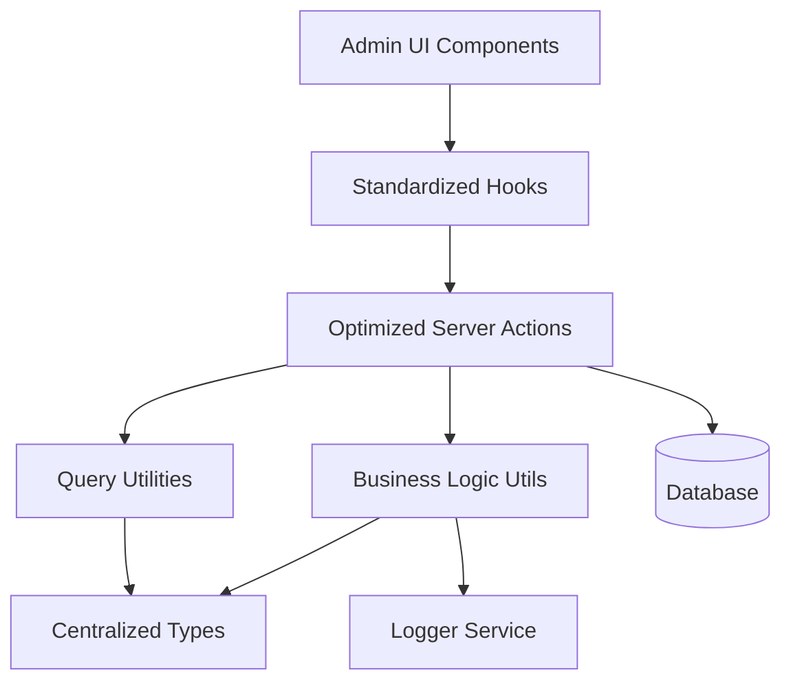
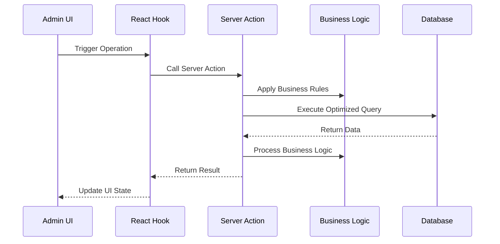

# Design Document

## Overview

This design document outlines the comprehensive improvement of the payment management system for admin users. The solution focuses on centralizing types, optimizing database operations, standardizing patterns, and improving maintainability while preserving all existing functionality.

## Architecture

### High-Level Architecture



### Data Flow Architecture



## Components and Interfaces

### 1. Centralized Type System

#### Core Types Location: `lib/types/payments/index.ts`

```typescript
// Base payment types
export type PaymentBase = typeof payments.$inferSelect;
export type PaymentInsert = typeof payments.$inferInsert;

// Related types
export type EnrollmentBase = typeof enrollments.$inferSelect;
export type ProfileBase = typeof profiles.$inferSelect;
export type IntakeBase = typeof intakes.$inferSelect;
export type CourseBase = typeof courses.$inferSelect;

// Comprehensive joined data types
export interface PaymentWithDetails {
  payment: PaymentBase;
  enrollment: EnrollmentBase | null;
  user: ProfileBase | null;
  intake: IntakeBase | null;
  course: CourseBase | null;
}

// List view optimized type
export interface PaymentListItem {
  id: string;
  amount: number;
  status: string;
  method: string;
  remarks: string | null;
  is_refunded: boolean;
  refunded_amount: number | null;
  paid_at: string | null;
  created_at: string;
  updated_at: string;
  enrollment: {
    id: string;
    status: string;
  } | null;
  user: {
    id: string;
    full_name: string | null;
    email: string | null;
  } | null;
  course: {
    id: string;
    title: string | null;
  } | null;
  intake: {
    id: string;
    start_date: string | null;
  } | null;
}

// Query parameter types
export interface PaymentQueryParams {
  page?: number;
  pageSize?: number;
  sortBy?: string;
  order?: 'asc' | 'desc';
  filters?: ColumnFiltersState;
  status?: string;
  method?: string;
  userId?: string;
  courseId?: string;
  search?: string;
}

// Business operation types
export interface PaymentCreateData {
  enrollment_id: string;
  amount: number;
  status?: string;
  method?: string;
  remarks?: string;
  paid_at?: string;
}

export interface PaymentUpdateData {
  id: string;
  amount?: number;
  status?: string;
  method?: string;
  remarks?: string;
  paid_at?: string;
}

// Refund types
export interface PaymentRefundData {
  id: string;
  refund_amount: number;
  remarks?: string;
}

// Status update types
export interface PaymentStatusUpdate {
  id: string;
  status: string;
  remarks?: string;
}
```

### 2. Optimized Server Actions

#### Structure: `lib/server-actions/admin/payments.ts`

```typescript
// Single comprehensive list function
export async function adminPaymentList(params: PaymentQueryParams): Promise<ApiResponse<{
  data: PaymentListItem[];
  total: number;
  page: number;
  pageSize: number;
}>>

// Single comprehensive details function
export async function adminPaymentDetails(id: string): Promise<ApiResponse<PaymentWithDetails>>

// Optimized CRUD operations
export async function adminPaymentCreate(data: PaymentCreateData): Promise<ApiResponse<PaymentBase>>
export async function adminPaymentUpdate(data: PaymentUpdateData): Promise<ApiResponse<PaymentBase>>
export async function adminPaymentDelete(id: string): Promise<ApiResponse<void>>

// Business operations
export async function adminPaymentUpdateStatus(data: PaymentStatusUpdate): Promise<ApiResponse<PaymentBase>>
export async function adminPaymentBulkUpdateStatus(paymentIds: string[], status: string): Promise<ApiResponse<PaymentBase[]>>
export async function adminPaymentRefund(data: PaymentRefundData): Promise<ApiResponse<PaymentBase>>
export async function adminPaymentBulkRefund(paymentIds: string[], refundAmounts: number[]): Promise<ApiResponse<PaymentBase[]>>
```

### 3. Business Logic Utilities

#### Structure: `lib/utils/payments/index.ts`

```typescript
// Payment validation
export function validatePaymentData(data: PaymentCreateData | PaymentUpdateData): ValidationResult

// Status management
export function validatePaymentStatusTransition(from: string, to: string): boolean
export function canUpdatePaymentStatus(userRole: string, currentStatus: string, newStatus: string): boolean

// Refund management
export function validatePaymentRefund(paymentId: string, refundAmount: number): Promise<boolean>
export function calculateRefundAmount(paymentAmount: number, alreadyRefunded: number): number

// Business rule enforcement
export function validatePaymentAmount(amount: number): boolean
export function validatePaymentMethod(method: string): boolean
```

### 4. Standardized Hooks

#### Structure: `hooks/admin/payments.ts`

```typescript
// List operations
export function useAdminPaymentList(params: PaymentQueryParams)
export function useAdminPaymentListByStatus(status: string)
export function useAdminPaymentListByUser(userId: string)
export function useAdminPaymentListByCourse(courseId: string)

// Detail operations
export function useAdminPaymentDetails(id: string)

// Mutation operations
export function useAdminPaymentCreate()
export function useAdminPaymentUpdate()
export function useAdminPaymentDelete()
export function useAdminPaymentUpdateStatus()
export function useAdminPaymentBulkUpdateStatus()
export function useAdminPaymentRefund()
export function useAdminPaymentBulkRefund()

// Specialized operations
export function useAdminPaymentMetrics()
export function useAdminPaymentExport()
export function useAdminPaymentStats()
```

### 5. Query Optimization

#### Column Maps and Select Patterns

```typescript
// Optimized column mappings
export const paymentColumnMap = {
  id: paymentSchema.id,
  amount: paymentSchema.amount,
  status: paymentSchema.status,
  method: paymentSchema.method,
  remarks: paymentSchema.remarks,
  is_refunded: paymentSchema.is_refunded,
  refunded_amount: paymentSchema.refunded_amount,
  paid_at: paymentSchema.paid_at,
  created_at: paymentSchema.created_at,
  updated_at: paymentSchema.updated_at,
  user_name: profileSchema.full_name,
  user_email: profileSchema.email,
  course_title: courseSchema.title,
  intake_start_date: intakeSchema.start_date,
};

// Optimized select patterns
export const paymentListSelect = {
  id: paymentSchema.id,
  amount: paymentSchema.amount,
  status: paymentSchema.status,
  method: paymentSchema.method,
  remarks: paymentSchema.remarks,
  is_refunded: paymentSchema.is_refunded,
  refunded_amount: paymentSchema.refunded_amount,
  paid_at: paymentSchema.paid_at,
  created_at: paymentSchema.created_at,
  updated_at: paymentSchema.updated_at,
  enrollment: {
    id: enrollmentSchema.id,
    status: enrollmentSchema.status,
  },
  user: {
    id: profileSchema.id,
    full_name: profileSchema.full_name,
    email: profileSchema.email,
  },
  course: {
    id: courseSchema.id,
    title: courseSchema.title,
  },
  intake: {
    id: intakeSchema.id,
    start_date: intakeSchema.start_date,
  },
};
```

## Data Models

### Database Query Patterns

#### Optimized List Query
```sql
SELECT 
  p.id, p.amount, p.status, p.method, p.remarks, p.is_refunded, p.refunded_amount, p.paid_at, p.created_at, p.updated_at,
  e.id as enrollment_id, e.status as enrollment_status,
  pr.id as user_id, pr.full_name as user_name, pr.email as user_email,
  c.id as course_id, c.title as course_title,
  i.id as intake_id, i.start_date as intake_start_date
FROM payments p
LEFT JOIN enrollments e ON p.enrollment_id = e.id
LEFT JOIN profiles pr ON e.user_id = pr.id
LEFT JOIN intakes i ON e.intake_id = i.id
LEFT JOIN courses c ON i.course_id = c.id
WHERE [dynamic filters]
ORDER BY [dynamic sorting]
LIMIT ? OFFSET ?
```

#### Optimized Details Query
```sql
SELECT 
  p.*,
  e.* as enrollment,
  pr.* as user,
  i.* as intake,
  c.* as course
FROM payments p
LEFT JOIN enrollments e ON p.enrollment_id = e.id
LEFT JOIN profiles pr ON e.user_id = pr.id
LEFT JOIN intakes i ON e.intake_id = i.id
LEFT JOIN courses c ON i.course_id = c.id
WHERE p.id = ?
```

### Caching Strategy

```typescript
// Query key structure
const paymentQueryKeys = {
  all: ['payments'] as const,
  lists: () => [...paymentQueryKeys.all, 'list'] as const,
  list: (params: PaymentQueryParams) => [...paymentQueryKeys.lists(), params] as const,
  details: () => [...paymentQueryKeys.all, 'detail'] as const,
  detail: (id: string) => [...paymentQueryKeys.details(), id] as const,
  byStatus: (status: string) => [...paymentQueryKeys.all, 'status', status] as const,
  byUser: (userId: string) => [...paymentQueryKeys.all, 'user', userId] as const,
  byCourse: (courseId: string) => [...paymentQueryKeys.all, 'course', courseId] as const,
  stats: () => [...paymentQueryKeys.all, 'stats'] as const,
};

// Cache invalidation patterns
const invalidationPatterns = {
  onPaymentCreate: [paymentQueryKeys.all],
  onPaymentUpdate: (id: string) => [
    paymentQueryKeys.all,
    paymentQueryKeys.detail(id)
  ],
  onPaymentDelete: (id: string) => [
    paymentQueryKeys.all,
    paymentQueryKeys.detail(id)
  ],
  onStatusUpdate: (id: string, newStatus: string) => [
    paymentQueryKeys.all,
    paymentQueryKeys.detail(id),
    paymentQueryKeys.byStatus(newStatus)
  ],
  onRefund: (id: string) => [
    paymentQueryKeys.all,
    paymentQueryKeys.detail(id)
  ],
};
```

## Error Handling

### Standardized Error Response Format

```typescript
interface ApiResponse<T> {
  success: boolean;
  data?: T;
  error?: string;
  code?: string;
  details?: Record<string, any>;
}

// Error handling utility
export function handlePaymentError(error: unknown, operation: string): ApiResponse<never> {
  if (error instanceof ValidationError) {
    return {
      success: false,
      error: error.message,
      code: 'VALIDATION_ERROR',
      details: error.details
    };
  }
  
  if (error instanceof DatabaseError) {
    logger.error(`Payment ${operation} failed:`, error);
    return {
      success: false,
      error: 'Database operation failed',
      code: 'DATABASE_ERROR'
    };
  }
  
  logger.error(`Unexpected error in payment ${operation}:`, error);
  return {
    success: false,
    error: 'An unexpected error occurred',
    code: 'UNKNOWN_ERROR'
  };
}
```

### Business Rule Validation

```typescript
export class PaymentValidationError extends Error {
  constructor(
    message: string,
    public code: string,
    public details?: Record<string, any>
  ) {
    super(message);
    this.name = 'PaymentValidationError';
  }
}

export function validatePaymentAmount(amount: number): void {
  if (amount <= 0) {
    throw new PaymentValidationError(
      'Payment amount must be greater than zero',
      'INVALID_AMOUNT',
      { amount }
    );
  }
  
  if (amount > 1000000) {
    throw new PaymentValidationError(
      'Payment amount cannot exceed 1,000,000',
      'AMOUNT_TOO_HIGH',
      { amount }
    );
  }
}
```

## Testing Strategy

### Unit Testing Approach

```typescript
// Server action tests
describe('adminPaymentList', () => {
  it('should return paginated payment list with proper joins');
  it('should handle filters correctly');
  it('should handle sorting correctly');
  it('should handle empty results gracefully');
});

// Business logic tests
describe('payment business logic', () => {
  it('should validate payment amounts correctly');
  it('should handle status transitions properly');
  it('should manage refunds correctly');
});

// Hook tests
describe('payment hooks', () => {
  it('should invalidate cache correctly on mutations');
  it('should handle loading states properly');
  it('should handle error states correctly');
});
```

### Integration Testing

```typescript
// End-to-end payment flow tests
describe('payment management flow', () => {
  it('should create payment for enrollment');
  it('should update payment details');
  it('should update payment status');
  it('should process payment refunds');
  it('should delete payment entry');
  it('should maintain data consistency across operations');
});
```

## Performance Considerations

### Database Optimization
- Use proper indexes on frequently queried columns
- Implement query result caching for list operations
- Use connection pooling for concurrent requests
- Optimize JOIN operations with proper foreign key relationships

### Frontend Optimization
- Implement proper React Query caching strategies
- Use optimistic updates for better UX
- Implement virtual scrolling for large lists
- Use proper loading states and skeleton screens

### Memory Management
- Implement proper cleanup in React hooks
- Use weak references where appropriate
- Implement proper garbage collection for large datasets
- Monitor memory usage in production

## Security Considerations

### Access Control
- Implement proper role-based access control
- Validate user permissions for each operation
- Audit trail for all payment modifications
- Rate limiting for API endpoints

### Data Validation
- Server-side validation for all inputs
- SQL injection prevention through parameterized queries
- XSS prevention in user-generated content
- CSRF protection for state-changing operations

### Privacy Protection
- Proper data anonymization for exports
- Secure handling of personal information
- Compliance with data protection regulations
- Secure logging without sensitive data exposure