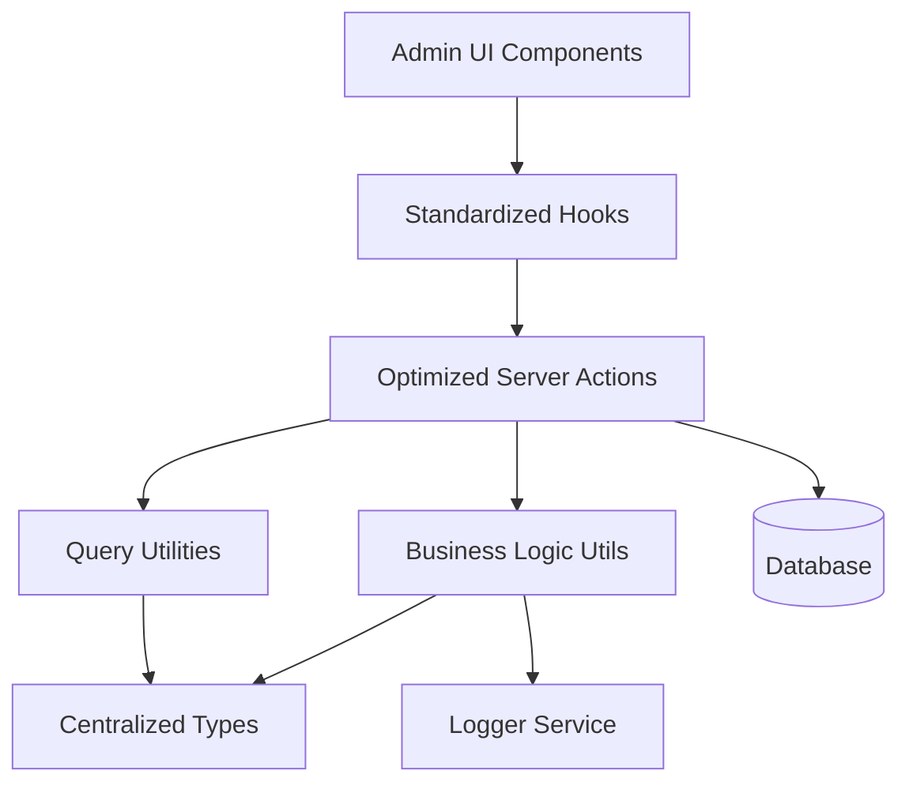
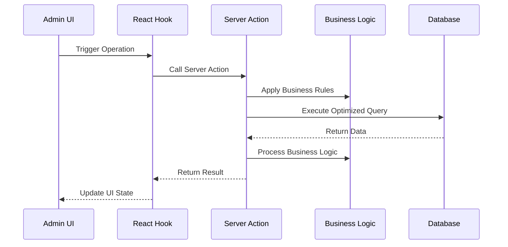

# Design Document

## Overview

This design document outlines the comprehensive improvement of the profile management system for admin users. The solution focuses on centralizing types, optimizing database operations, standardizing patterns, and improving maintainability while preserving all existing functionality.

## Architecture

### High-Level Architecture



### Data Flow Architecture



## Components and Interfaces

### 1. Centralized Type System

#### Core Types Location: `lib/types/profiles/index.ts`

```typescript
// Base profile types
export type ProfileBase = typeof profiles.$inferSelect;
export type ProfileInsert = typeof profiles.$inferInsert;

// Comprehensive joined data types
export interface ProfileWithDetails {
  profile: ProfileBase;
  authUser: AuthUserBase | null;
}

// List view optimized type
export interface ProfileListItem {
  id: string;
  full_name: string;
  email: string;
  phone: string | null;
  role: string;
  created_at: string;
  updated_at: string;
  deleted_at: string | null;
  deletion_scheduled_for: string | null;
  deletion_count: number;
}

// Query parameter types
export interface ProfileQueryParams {
  page?: number;
  pageSize?: number;
  sortBy?: string;
  order?: 'asc' | 'desc';
  filters?: ColumnFiltersState;
  role?: string;
  status?: 'active' | 'deleted' | 'scheduled';
  search?: string;
}

// Business operation types
export interface ProfileCreateData {
  id: string;
  full_name: string;
  email: string;
  phone?: string;
  role?: string;
}

export interface ProfileUpdateData {
  id: string;
  full_name?: string;
  email?: string;
  phone?: string;
  role?: string;
}

// Status update types
export interface ProfileStatusUpdate {
  id: string;
  deleted_at?: string | null;
  deletion_scheduled_for?: string | null;
  deletion_count?: number;
}
```

### 2. Optimized Server Actions

#### Structure: `lib/server-actions/admin/profiles.ts`

```typescript
// Single comprehensive list function
export async function adminProfileList(params: ProfileQueryParams): Promise<ApiResponse<{
  data: ProfileListItem[];
  total: number;
  page: number;
  pageSize: number;
}>>

// Single comprehensive details function
export async function adminProfileDetails(id: string): Promise<ApiResponse<ProfileWithDetails>>

// Optimized CRUD operations
export async function adminProfileCreate(data: ProfileCreateData): Promise<ApiResponse<ProfileBase>>
export async function adminProfileUpdate(data: ProfileUpdateData): Promise<ApiResponse<ProfileBase>>
export async function adminProfileDelete(id: string): Promise<ApiResponse<void>>

// Business operations
export async function adminProfileUpdateStatus(data: ProfileStatusUpdate): Promise<ApiResponse<ProfileBase>>
export async function adminProfileBulkUpdateStatus(profileIds: string[], status: string): Promise<ApiResponse<ProfileBase[]>>
export async function adminProfileRestore(id: string): Promise<ApiResponse<ProfileBase>>
```

### 3. Business Logic Utilities

#### Structure: `lib/utils/profiles/index.ts`

```typescript
// Profile validation
export function validateProfileData(data: ProfileCreateData | ProfileUpdateData): ValidationResult

// Status management
export function validateProfileStatusTransition(from: string, to: string): boolean
export function canUpdateProfileStatus(userRole: string, currentStatus: string, newStatus: string): boolean

// Business rule enforcement
export function validateProfileFields(fullName: string, email: string, phone?: string): boolean
export function sanitizeProfileData(data: ProfileCreateData | ProfileUpdateData): ProfileCreateData | ProfileUpdateData
```

### 4. Standardized Hooks

#### Structure: `hooks/admin/profiles.ts`

```typescript
// List operations
export function useAdminProfileList(params: ProfileQueryParams)
export function useAdminProfileListByRole(role: string)
export function useAdminProfileListByStatus(status: string)

// Detail operations
export function useAdminProfileDetails(id: string)

// Mutation operations
export function useAdminProfileCreate()
export function useAdminProfileUpdate()
export function useAdminProfileDelete()
export function useAdminProfileUpdateStatus()
export function useAdminProfileBulkUpdateStatus()
export function useAdminProfileRestore()

// Specialized operations
export function useAdminProfileMetrics()
export function useAdminProfileExport()
```

### 5. Query Optimization

#### Column Maps and Select Patterns

```typescript
// Optimized column mappings
export const profileColumnMap = {
  id: profileSchema.id,
  full_name: profileSchema.full_name,
  email: profileSchema.email,
  phone: profileSchema.phone,
  role: profileSchema.role,
  created_at: profileSchema.created_at,
  updated_at: profileSchema.updated_at,
  deleted_at: profileSchema.deleted_at,
  deletion_scheduled_for: profileSchema.deletion_scheduled_for,
  deletion_count: profileSchema.deletion_count,
};

// Optimized select patterns
export const profileListSelect = {
  id: profileSchema.id,
  full_name: profileSchema.full_name,
  email: profileSchema.email,
  phone: profileSchema.phone,
  role: profileSchema.role,
  created_at: profileSchema.created_at,
  updated_at: profileSchema.updated_at,
  deleted_at: profileSchema.deleted_at,
  deletion_scheduled_for: profileSchema.deletion_scheduled_for,
  deletion_count: profileSchema.deletion_count,
};
```

## Data Models

### Database Query Patterns

#### Optimized List Query
```sql
SELECT 
  p.id, p.full_name, p.email, p.phone, p.role, p.created_at, p.updated_at, 
  p.deleted_at, p.deletion_scheduled_for, p.deletion_count
FROM profiles p
WHERE [dynamic filters]
ORDER BY [dynamic sorting]
LIMIT ? OFFSET ?
```

#### Optimized Details Query
```sql
SELECT 
  p.*,
  au.* as authUser
FROM profiles p
LEFT JOIN auth_users au ON p.id = au.id
WHERE p.id = ?
```

### Caching Strategy

```typescript
// Query key structure
const profileQueryKeys = {
  all: ['profiles'] as const,
  lists: () => [...profileQueryKeys.all, 'list'] as const,
  list: (params: ProfileQueryParams) => [...profileQueryKeys.lists(), params] as const,
  details: () => [...profileQueryKeys.all, 'detail'] as const,
  detail: (id: string) => [...profileQueryKeys.details(), id] as const,
  byRole: (role: string) => [...profileQueryKeys.all, 'role', role] as const,
  byStatus: (status: string) => [...profileQueryKeys.all, 'status', status] as const,
  metrics: () => [...profileQueryKeys.all, 'metrics'] as const,
};

// Cache invalidation patterns
const invalidationPatterns = {
  onProfileCreate: [profileQueryKeys.all],
  onProfileUpdate: (id: string) => [
    profileQueryKeys.all,
    profileQueryKeys.detail(id)
  ],
  onProfileDelete: (id: string) => [
    profileQueryKeys.all,
    profileQueryKeys.detail(id)
  ],
  onStatusUpdate: (id: string, newStatus: string) => [
    profileQueryKeys.all,
    profileQueryKeys.detail(id),
    profileQueryKeys.byStatus(newStatus)
  ],
};
```

## Error Handling

### Standardized Error Response Format

```typescript
interface ApiResponse<T> {
  success: boolean;
  data?: T;
  error?: string;
  code?: string;
  details?: Record<string, any>;
}

// Error handling utility
export function handleProfileError(error: unknown, operation: string): ApiResponse<never> {
  if (error instanceof ValidationError) {
    return {
      success: false,
      error: error.message,
      code: 'VALIDATION_ERROR',
      details: error.details
    };
  }
  
  if (error instanceof DatabaseError) {
    logger.error(`Profile ${operation} failed:`, error);
    return {
      success: false,
      error: 'Database operation failed',
      code: 'DATABASE_ERROR'
    };
  }
  
  logger.error(`Unexpected error in profile ${operation}:`, error);
  return {
    success: false,
    error: 'An unexpected error occurred',
    code: 'UNKNOWN_ERROR'
  };
}
```

### Business Rule Validation

```typescript
export class ProfileValidationError extends Error {
  constructor(
    message: string,
    public code: string,
    public details?: Record<string, any>
  ) {
    super(message);
    this.name = 'ProfileValidationError';
  }
}

export function validateProfileFields(fullName: string, email: string, phone?: string): void {
  if (!fullName || fullName.trim().length === 0) {
    throw new ProfileValidationError(
      'Full name is required',
      'FULL_NAME_REQUIRED',
      { fullName }
    );
  }
  
  if (fullName.length > 255) {
    throw new ProfileValidationError(
      'Full name cannot exceed 255 characters',
      'FULL_NAME_TOO_LONG',
      { fullName, length: fullName.length }
    );
  }
  
  if (!email || email.trim().length === 0) {
    throw new ProfileValidationError(
      'Email is required',
      'EMAIL_REQUIRED',
      { email }
    );
  }
  
  const emailRegex = /^[^\s@]+@[^\s@]+\.[^\s@]+$/;
  if (!emailRegex.test(email)) {
    throw new ProfileValidationError(
      'Invalid email format',
      'INVALID_EMAIL',
      { email }
    );
  }
  
  if (email.length > 255) {
    throw new ProfileValidationError(
      'Email cannot exceed 255 characters',
      'EMAIL_TOO_LONG',
      { email, length: email.length }
    );
  }
  
  if (phone && phone.length > 20) {
    throw new ProfileValidationError(
      'Phone number cannot exceed 20 characters',
      'PHONE_TOO_LONG',
      { phone, length: phone.length }
    );
  }
}
```

## Testing Strategy

### Unit Testing Approach

```typescript
// Server action tests
describe('adminProfileList', () => {
  it('should return paginated profile list with proper joins');
  it('should handle filters correctly');
  it('should handle sorting correctly');
  it('should handle empty results gracefully');
});

// Business logic tests
describe('profile business logic', () => {
  it('should validate profile fields correctly');
  it('should handle status transitions properly');
  it('should sanitize profile data correctly');
});

// Hook tests
describe('profile hooks', () => {
  it('should invalidate cache correctly on mutations');
  it('should handle loading states properly');
  it('should handle error states correctly');
});
```

### Integration Testing

```typescript
// End-to-end profile flow tests
describe('profile management flow', () => {
  it('should create profile for user');
  it('should update profile details');
  it('should update profile status');
  it('should delete profile entry');
  it('should restore deleted profile');
  it('should maintain data consistency across operations');
});
```

## Performance Considerations

### Database Optimization
- Use proper indexes on frequently queried columns
- Implement query result caching for list operations
- Use connection pooling for concurrent requests
- Optimize JOIN operations with proper foreign key relationships

### Frontend Optimization
- Implement proper React Query caching strategies
- Use optimistic updates for better UX
- Implement virtual scrolling for large lists
- Use proper loading states and skeleton screens

### Memory Management
- Implement proper cleanup in React hooks
- Use weak references where appropriate
- Implement proper garbage collection for large datasets
- Monitor memory usage in production

## Security Considerations

### Access Control
- Implement proper role-based access control
- Validate user permissions for each operation
- Audit trail for all profile modifications
- Rate limiting for API endpoints

### Data Validation
- Server-side validation for all inputs
- SQL injection prevention through parameterized queries
- XSS prevention in user-generated content
- CSRF protection for state-changing operations

### Privacy Protection
- Proper data anonymization for exports
- Secure handling of personal information
- Compliance with data protection regulations
- Secure logging without sensitive data exposure