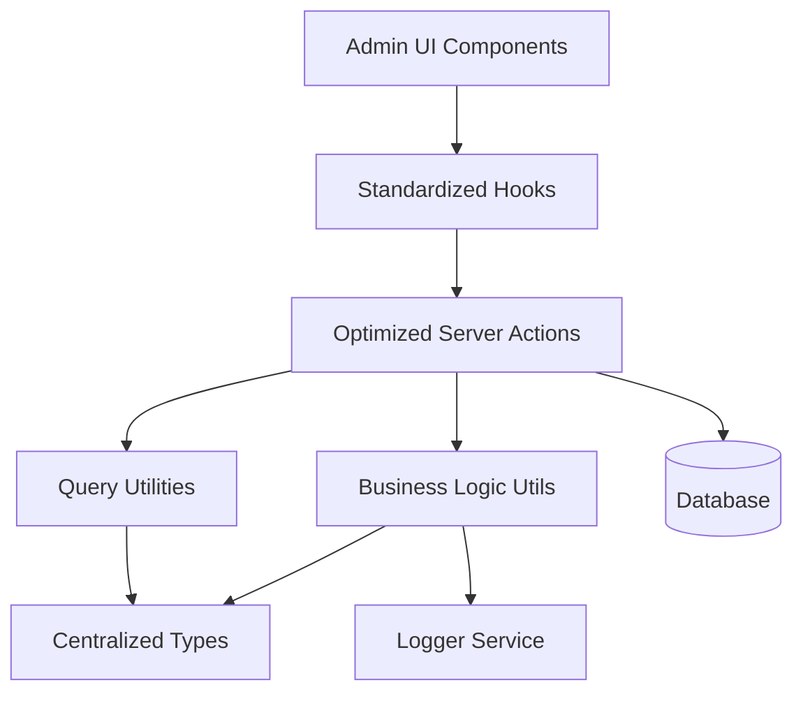
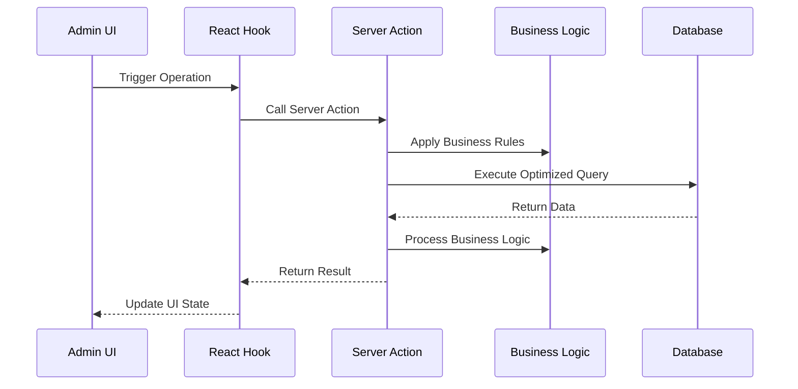

# Design Document

## Overview

This design document outlines the comprehensive improvement of the refund management system for admin users. The solution focuses on centralizing types, optimizing database operations, standardizing patterns, and improving maintainability while preserving all existing functionality.

## Architecture

### High-Level Architecture



### Data Flow Architecture



## Components and Interfaces

### 1. Centralized Type System

#### Core Types Location: `lib/types/refunds/index.ts`

```typescript
// Base refund types
export type RefundBase = typeof refunds.$inferSelect;
export type RefundInsert = typeof refunds.$inferInsert;

// Related types
export type PaymentBase = typeof payments.$inferSelect;
export type EnrollmentBase = typeof enrollments.$inferSelect;
export type ProfileBase = typeof profiles.$inferSelect;

// Comprehensive joined data types
export interface RefundWithDetails {
  refund: RefundBase;
  payment: PaymentBase | null;
  enrollment: EnrollmentBase | null;
  user: ProfileBase | null;
}

// List view optimized type
export interface RefundListItem {
  id: string;
  reason: string;
  amount: number;
  created_at: string;
  updated_at: string;
  payment: {
    id: string;
    amount: number;
    status: string;
  } | null;
  enrollment: {
    id: string;
    status: string;
  } | null;
  user: {
    id: string;
    full_name: string | null;
    email: string | null;
  } | null;
}

// Query parameter types
export interface RefundQueryParams {
  page?: number;
  pageSize?: number;
  sortBy?: string;
  order?: 'asc' | 'desc';
  filters?: ColumnFiltersState;
  status?: string;
  userId?: string;
  search?: string;
}

// Business operation types
export interface RefundCreateData {
  payment_id: string;
  enrollment_id: string;
  user_id: string;
  reason: string;
  amount: number;
}

export interface RefundUpdateData {
  id: string;
  reason?: string;
  amount?: number;
}

// Processing types
export interface RefundProcessData {
  id: string;
  status: string;
  processed_by?: string;
  processed_at?: string;
  notes?: string;
}
```

### 2. Optimized Server Actions

#### Structure: `lib/server-actions/admin/refunds.ts`

```typescript
// Single comprehensive list function
export async function adminRefundList(params: RefundQueryParams): Promise<ApiResponse<{
  data: RefundListItem[];
  total: number;
  page: number;
  pageSize: number;
}>>

// Single comprehensive details function
export async function adminRefundDetails(id: string): Promise<ApiResponse<RefundWithDetails>>

// Optimized CRUD operations
export async function adminRefundCreate(data: RefundCreateData): Promise<ApiResponse<RefundBase>>
export async function adminRefundUpdate(data: RefundUpdateData): Promise<ApiResponse<RefundBase>>
export async function adminRefundDelete(id: string): Promise<ApiResponse<void>>

// Business operations
export async function adminRefundProcess(data: RefundProcessData): Promise<ApiResponse<RefundBase>>
export async function adminRefundBulkProcess(refundIds: string[], status: string): Promise<ApiResponse<RefundBase[]>>
export async function adminRefundApprove(id: string): Promise<ApiResponse<RefundBase>>
export async function adminRefundReject(id: string, reason: string): Promise<ApiResponse<RefundBase>>
```

### 3. Business Logic Utilities

#### Structure: `lib/utils/refunds/index.ts`

```typescript
// Refund validation
export function validateRefundData(data: RefundCreateData | RefundUpdateData): ValidationResult

// Processing management
export function validateRefundProcessing(refundId: string, status: string): Promise<boolean>
export function canProcessRefund(userRole: string, refundStatus: string): boolean

// Business rule enforcement
export function validateRefundAmount(refundAmount: number, paymentAmount: number, alreadyRefunded: number): boolean
export function validateRefundReason(reason: string): boolean
```

### 4. Standardized Hooks

#### Structure: `hooks/admin/refunds.ts`

```typescript
// List operations
export function useAdminRefundList(params: RefundQueryParams)
export function useAdminRefundListByStatus(status: string)
export function useAdminRefundListByUser(userId: string)

// Detail operations
export function useAdminRefundDetails(id: string)

// Mutation operations
export function useAdminRefundCreate()
export function useAdminRefundUpdate()
export function useAdminRefundDelete()
export function useAdminRefundProcess()
export function useAdminRefundBulkProcess()
export function useAdminRefundApprove()
export function useAdminRefundReject()

// Specialized operations
export function useAdminRefundMetrics()
export function useAdminRefundExport()
export function useAdminRefundStats()
```

### 5. Query Optimization

#### Column Maps and Select Patterns

```typescript
// Optimized column mappings
export const refundColumnMap = {
  id: refundSchema.id,
  reason: refundSchema.reason,
  amount: refundSchema.amount,
  created_at: refundSchema.created_at,
  updated_at: refundSchema.updated_at,
  payment_amount: paymentSchema.amount,
  payment_status: paymentSchema.status,
  enrollment_status: enrollmentSchema.status,
  user_name: profileSchema.full_name,
  user_email: profileSchema.email,
};

// Optimized select patterns
export const refundListSelect = {
  id: refundSchema.id,
  reason: refundSchema.reason,
  amount: refundSchema.amount,
  created_at: refundSchema.created_at,
  updated_at: refundSchema.updated_at,
  payment: {
    id: paymentSchema.id,
    amount: paymentSchema.amount,
    status: paymentSchema.status,
  },
  enrollment: {
    id: enrollmentSchema.id,
    status: enrollmentSchema.status,
  },
  user: {
    id: profileSchema.id,
    full_name: profileSchema.full_name,
    email: profileSchema.email,
  },
};
```

## Data Models

### Database Query Patterns

#### Optimized List Query
```sql
SELECT 
  r.id, r.reason, r.amount, r.created_at, r.updated_at,
  p.id as payment_id, p.amount as payment_amount, p.status as payment_status,
  e.id as enrollment_id, e.status as enrollment_status,
  pr.id as user_id, pr.full_name as user_name, pr.email as user_email
FROM refunds r
LEFT JOIN payments p ON r.payment_id = p.id
LEFT JOIN enrollments e ON r.enrollment_id = e.id
LEFT JOIN profiles pr ON r.user_id = pr.id
WHERE [dynamic filters]
ORDER BY [dynamic sorting]
LIMIT ? OFFSET ?
```

#### Optimized Details Query
```sql
SELECT 
  r.*,
  p.* as payment,
  e.* as enrollment,
  pr.* as user
FROM refunds r
LEFT JOIN payments p ON r.payment_id = p.id
LEFT JOIN enrollments e ON r.enrollment_id = e.id
LEFT JOIN profiles pr ON r.user_id = pr.id
WHERE r.id = ?
```

### Caching Strategy

```typescript
// Query key structure
const refundQueryKeys = {
  all: ['refunds'] as const,
  lists: () => [...refundQueryKeys.all, 'list'] as const,
  list: (params: RefundQueryParams) => [...refundQueryKeys.lists(), params] as const,
  details: () => [...refundQueryKeys.all, 'detail'] as const,
  detail: (id: string) => [...refundQueryKeys.details(), id] as const,
  byStatus: (status: string) => [...refundQueryKeys.all, 'status', status] as const,
  byUser: (userId: string) => [...refundQueryKeys.all, 'user', userId] as const,
  stats: () => [...refundQueryKeys.all, 'stats'] as const,
};

// Cache invalidation patterns
const invalidationPatterns = {
  onRefundCreate: [refundQueryKeys.all],
  onRefundUpdate: (id: string) => [
    refundQueryKeys.all,
    refundQueryKeys.detail(id)
  ],
  onRefundDelete: (id: string) => [
    refundQueryKeys.all,
    refundQueryKeys.detail(id)
  ],
  onRefundProcess: (id: string, newStatus: string) => [
    refundQueryKeys.all,
    refundQueryKeys.detail(id),
    refundQueryKeys.byStatus(newStatus)
  ],
};
```

## Error Handling

### Standardized Error Response Format

```typescript
interface ApiResponse<T> {
  success: boolean;
  data?: T;
  error?: string;
  code?: string;
  details?: Record<string, any>;
}

// Error handling utility
export function handleRefundError(error: unknown, operation: string): ApiResponse<never> {
  if (error instanceof ValidationError) {
    return {
      success: false,
      error: error.message,
      code: 'VALIDATION_ERROR',
      details: error.details
    };
  }
  
  if (error instanceof DatabaseError) {
    logger.error(`Refund ${operation} failed:`, error);
    return {
      success: false,
      error: 'Database operation failed',
      code: 'DATABASE_ERROR'
    };
  }
  
  logger.error(`Unexpected error in refund ${operation}:`, error);
  return {
    success: false,
    error: 'An unexpected error occurred',
    code: 'UNKNOWN_ERROR'
  };
}
```

### Business Rule Validation

```typescript
export class RefundValidationError extends Error {
  constructor(
    message: string,
    public code: string,
    public details?: Record<string, any>
  ) {
    super(message);
    this.name = 'RefundValidationError';
  }
}

export function validateRefundAmount(refundAmount: number, paymentAmount: number, alreadyRefunded: number): void {
  if (refundAmount <= 0) {
    throw new RefundValidationError(
      'Refund amount must be greater than zero',
      'INVALID_AMOUNT',
      { refundAmount }
    );
  }
  
  const remainingBalance = paymentAmount - alreadyRefunded;
  if (refundAmount > remainingBalance) {
    throw new RefundValidationError(
      'Refund amount cannot exceed remaining balance',
      'AMOUNT_EXCEEDS_BALANCE',
      { refundAmount, remainingBalance, paymentAmount, alreadyRefunded }
    );
  }
}
```

## Testing Strategy

### Unit Testing Approach

```typescript
// Server action tests
describe('adminRefundList', () => {
  it('should return paginated refund list with proper joins');
  it('should handle filters correctly');
  it('should handle sorting correctly');
  it('should handle empty results gracefully');
});

// Business logic tests
describe('refund business logic', () => {
  it('should validate refund amounts correctly');
  it('should handle processing properly');
  it('should validate refund reasons correctly');
});

// Hook tests
describe('refund hooks', () => {
  it('should invalidate cache correctly on mutations');
  it('should handle loading states properly');
  it('should handle error states correctly');
});
```

### Integration Testing

```typescript
// End-to-end refund flow tests
describe('refund management flow', () => {
  it('should create refund request');
  it('should update refund details');
  it('should process refund approval');
  it('should process refund rejection');
  it('should delete refund entry');
  it('should maintain data consistency across operations');
});
```

## Performance Considerations

### Database Optimization
- Use proper indexes on frequently queried columns
- Implement query result caching for list operations
- Use connection pooling for concurrent requests
- Optimize JOIN operations with proper foreign key relationships

### Frontend Optimization
- Implement proper React Query caching strategies
- Use optimistic updates for better UX
- Implement virtual scrolling for large lists
- Use proper loading states and skeleton screens

### Memory Management
- Implement proper cleanup in React hooks
- Use weak references where appropriate
- Implement proper garbage collection for large datasets
- Monitor memory usage in production

## Security Considerations

### Access Control
- Implement proper role-based access control
- Validate user permissions for each operation
- Audit trail for all refund modifications
- Rate limiting for API endpoints

### Data Validation
- Server-side validation for all inputs
- SQL injection prevention through parameterized queries
- XSS prevention in user-generated content
- CSRF protection for state-changing operations

### Privacy Protection
- Proper data anonymization for exports
- Secure handling of personal information
- Compliance with data protection regulations
- Secure logging without sensitive data exposure