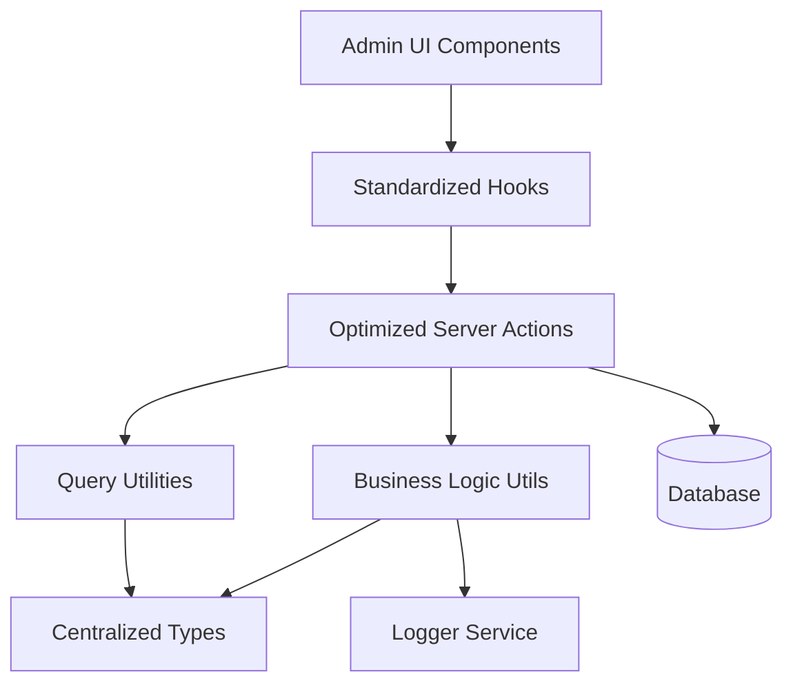
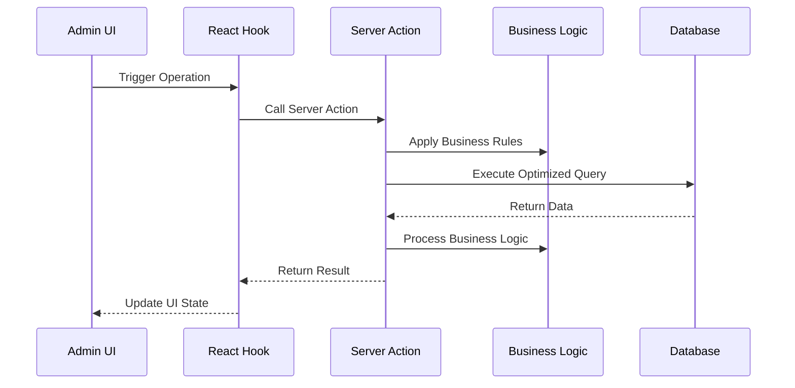

# Design Document

## Overview

This design document outlines the comprehensive improvement of the user deletion history management system for admin users. The solution focuses on centralizing types, optimizing database operations, standardizing patterns, and improving maintainability while preserving all existing functionality.

## Architecture

### High-Level Architecture



### Data Flow Architecture



## Components and Interfaces

### 1. Centralized Type System

#### Core Types Location: `lib/types/user-deletion-history/index.ts`

```typescript
// Base user deletion history types
export type UserDeletionHistoryBase = typeof userDeletionHistory.$inferSelect;
export type UserDeletionHistoryInsert = typeof userDeletionHistory.$inferInsert;

// Related types
export type AuthUserBase = typeof authUsers.$inferSelect;
export type ProfileBase = typeof profiles.$inferSelect;

// Comprehensive joined data types
export interface UserDeletionHistoryWithDetails {
  deletion: UserDeletionHistoryBase;
  user: AuthUserBase | null;
  profile: ProfileBase | null;
}

// List view optimized type
export interface UserDeletionHistoryListItem {
  id: string;
  user_id: string;
  deleted_at: string;
  restored_at: string | null;
  deletion_reason: string;
  scheduled_deletion_date: string | null;
  email_notification_sent: boolean;
  restoration_count: number;
  created_at: string;
  updated_at: string;
  user: {
    id: string;
    email: string | null;
    full_name: string | null;
  } | null;
}

// Query parameter types
export interface UserDeletionHistoryQueryParams {
  page?: number;
  pageSize?: number;
  sortBy?: string;
  order?: 'asc' | 'desc';
  filters?: ColumnFiltersState;
  status?: 'deleted' | 'restored' | 'scheduled';
  userId?: string;
  search?: string;
}

// Business operation types
export interface UserDeletionHistoryCreateData {
  user_id: string;
  deletion_reason: string;
  scheduled_deletion_date?: string;
  email_notification_sent?: boolean;
}

export interface UserDeletionHistoryUpdateData {
  id: string;
  restored_at?: string;
  email_notification_sent?: boolean;
  restoration_count?: number;
}

// Processing types
export interface UserDeletionHistoryProcessData {
  id: string;
  status: string;
  processed_by?: string;
  processed_at?: string;
  notes?: string;
}
```

### 2. Optimized Server Actions

#### Structure: `lib/server-actions/admin/user-deletion-history.ts`

```typescript
// Single comprehensive list function
export async function adminUserDeletionHistoryList(params: UserDeletionHistoryQueryParams): Promise<ApiResponse<{
  data: UserDeletionHistoryListItem[];
  total: number;
  page: number;
  pageSize: number;
}>>

// Single comprehensive details function
export async function adminUserDeletionHistoryDetails(id: string): Promise<ApiResponse<UserDeletionHistoryWithDetails>>

// Optimized CRUD operations
export async function adminUserDeletionHistoryCreate(data: UserDeletionHistoryCreateData): Promise<ApiResponse<UserDeletionHistoryBase>>
export async function adminUserDeletionHistoryUpdate(data: UserDeletionHistoryUpdateData): Promise<ApiResponse<UserDeletionHistoryBase>>
export async function adminUserDeletionHistoryDelete(id: string): Promise<ApiResponse<void>>

// Business operations
export async function adminUserDeletionHistoryProcess(data: UserDeletionHistoryProcessData): Promise<ApiResponse<UserDeletionHistoryBase>>
export async function adminUserDeletionHistoryBulkProcess(deletionIds: string[], status: string): Promise<ApiResponse<UserDeletionHistoryBase[]>>
export async function adminUserDeletionHistoryRestore(id: string): Promise<ApiResponse<UserDeletionHistoryBase>>
export async function adminUserDeletionHistoryCancel(id: string): Promise<ApiResponse<UserDeletionHistoryBase>>
```

### 3. Business Logic Utilities

#### Structure: `lib/utils/user-deletion-history/index.ts`

```typescript
// User deletion history validation
export function validateUserDeletionHistoryData(data: UserDeletionHistoryCreateData | UserDeletionHistoryUpdateData): ValidationResult

// Processing management
export function validateUserDeletionHistoryProcessing(deletionId: string, status: string): Promise<boolean>
export function canProcessUserDeletionHistory(userRole: string, deletionStatus: string): boolean

// Business rule enforcement
export function validateDeletionReason(reason: string): boolean
export function validateScheduledDeletionDate(date: string): boolean
export function canRestoreUser(deletionRecord: UserDeletionHistoryBase): boolean
```

### 4. Standardized Hooks

#### Structure: `hooks/admin/user-deletion-history.ts`

```typescript
// List operations
export function useAdminUserDeletionHistoryList(params: UserDeletionHistoryQueryParams)
export function useAdminUserDeletionHistoryListByStatus(status: string)
export function useAdminUserDeletionHistoryListByUser(userId: string)

// Detail operations
export function useAdminUserDeletionHistoryDetails(id: string)

// Mutation operations
export function useAdminUserDeletionHistoryCreate()
export function useAdminUserDeletionHistoryUpdate()
export function useAdminUserDeletionHistoryDelete()
export function useAdminUserDeletionHistoryProcess()
export function useAdminUserDeletionHistoryBulkProcess()
export function useAdminUserDeletionHistoryRestore()
export function useAdminUserDeletionHistoryCancel()

// Specialized operations
export function useAdminUserDeletionHistoryMetrics()
export function useAdminUserDeletionHistoryExport()
export function useAdminUserDeletionHistoryStats()
```

### 5. Query Optimization

#### Column Maps and Select Patterns

```typescript
// Optimized column mappings
export const userDeletionHistoryColumnMap = {
  id: userDeletionHistorySchema.id,
  user_id: userDeletionHistorySchema.user_id,
  deleted_at: userDeletionHistorySchema.deleted_at,
  restored_at: userDeletionHistorySchema.restored_at,
  deletion_reason: userDeletionHistorySchema.deletion_reason,
  scheduled_deletion_date: userDeletionHistorySchema.scheduled_deletion_date,
  email_notification_sent: userDeletionHistorySchema.email_notification_sent,
  restoration_count: userDeletionHistorySchema.restoration_count,
  created_at: userDeletionHistorySchema.created_at,
  updated_at: userDeletionHistorySchema.updated_at,
  user_email: authUserSchema.email,
  user_full_name: profileSchema.full_name,
};

// Optimized select patterns
export const userDeletionHistoryListSelect = {
  id: userDeletionHistorySchema.id,
  user_id: userDeletionHistorySchema.user_id,
  deleted_at: userDeletionHistorySchema.deleted_at,
  restored_at: userDeletionHistorySchema.restored_at,
  deletion_reason: userDeletionHistorySchema.deletion_reason,
  scheduled_deletion_date: userDeletionHistorySchema.scheduled_deletion_date,
  email_notification_sent: userDeletionHistorySchema.email_notification_sent,
  restoration_count: userDeletionHistorySchema.restoration_count,
  created_at: userDeletionHistorySchema.created_at,
  updated_at: userDeletionHistorySchema.updated_at,
  user: {
    id: authUserSchema.id,
    email: authUserSchema.email,
    full_name: profileSchema.full_name,
  },
};
```

## Data Models

### Database Query Patterns

#### Optimized List Query
```sql
SELECT 
  udh.id, udh.user_id, udh.deleted_at, udh.restored_at, udh.deletion_reason, 
  udh.scheduled_deletion_date, udh.email_notification_sent, udh.restoration_count, 
  udh.created_at, udh.updated_at,
  au.email as user_email,
  p.full_name as user_full_name
FROM user_deletion_history udh
LEFT JOIN auth_users au ON udh.user_id = au.id
LEFT JOIN profiles p ON udh.user_id = p.id
WHERE [dynamic filters]
ORDER BY [dynamic sorting]
LIMIT ? OFFSET ?
```

#### Optimized Details Query
```sql
SELECT 
  udh.*,
  au.* as user,
  p.* as profile
FROM user_deletion_history udh
LEFT JOIN auth_users au ON udh.user_id = au.id
LEFT JOIN profiles p ON udh.user_id = p.id
WHERE udh.id = ?
```

### Caching Strategy

```typescript
// Query key structure
const userDeletionHistoryQueryKeys = {
  all: ['user-deletion-history'] as const,
  lists: () => [...userDeletionHistoryQueryKeys.all, 'list'] as const,
  list: (params: UserDeletionHistoryQueryParams) => [...userDeletionHistoryQueryKeys.lists(), params] as const,
  details: () => [...userDeletionHistoryQueryKeys.all, 'detail'] as const,
  detail: (id: string) => [...userDeletionHistoryQueryKeys.details(), id] as const,
  byStatus: (status: string) => [...userDeletionHistoryQueryKeys.all, 'status', status] as const,
  byUser: (userId: string) => [...userDeletionHistoryQueryKeys.all, 'user', userId] as const,
  stats: () => [...userDeletionHistoryQueryKeys.all, 'stats'] as const,
};

// Cache invalidation patterns
const invalidationPatterns = {
  onDeletionHistoryCreate: [userDeletionHistoryQueryKeys.all],
  onDeletionHistoryUpdate: (id: string) => [
    userDeletionHistoryQueryKeys.all,
    userDeletionHistoryQueryKeys.detail(id)
  ],
  onDeletionHistoryDelete: (id: string) => [
    userDeletionHistoryQueryKeys.all,
    userDeletionHistoryQueryKeys.detail(id)
  ],
  onDeletionHistoryProcess: (id: string, newStatus: string) => [
    userDeletionHistoryQueryKeys.all,
    userDeletionHistoryQueryKeys.detail(id),
    userDeletionHistoryQueryKeys.byStatus(newStatus)
  ],
};
```

## Error Handling

### Standardized Error Response Format

```typescript
interface ApiResponse<T> {
  success: boolean;
  data?: T;
  error?: string;
  code?: string;
  details?: Record<string, any>;
}

// Error handling utility
export function handleUserDeletionHistoryError(error: unknown, operation: string): ApiResponse<never> {
  if (error instanceof ValidationError) {
    return {
      success: false,
      error: error.message,
      code: 'VALIDATION_ERROR',
      details: error.details
    };
  }
  
  if (error instanceof DatabaseError) {
    logger.error(`User Deletion History ${operation} failed:`, error);
    return {
      success: false,
      error: 'Database operation failed',
      code: 'DATABASE_ERROR'
    };
  }
  
  logger.error(`Unexpected error in user deletion history ${operation}:`, error);
  return {
    success: false,
    error: 'An unexpected error occurred',
    code: 'UNKNOWN_ERROR'
  };
}
```

### Business Rule Validation

```typescript
export class UserDeletionHistoryValidationError extends Error {
  constructor(
    message: string,
    public code: string,
    public details?: Record<string, any>
  ) {
    super(message);
    this.name = 'UserDeletionHistoryValidationError';
  }
}

export function validateDeletionReason(reason: string): void {
  if (!reason || reason.trim().length === 0) {
    throw new UserDeletionHistoryValidationError(
      'Deletion reason is required',
      'REASON_REQUIRED',
      { reason }
    );
  }
  
  if (reason.length > 1000) {
    throw new UserDeletionHistoryValidationError(
      'Deletion reason cannot exceed 1000 characters',
      'REASON_TOO_LONG',
      { reason, length: reason.length }
    );
  }
}
```

## Testing Strategy

### Unit Testing Approach

```typescript
// Server action tests
describe('adminUserDeletionHistoryList', () => {
  it('should return paginated user deletion history list with proper joins');
  it('should handle filters correctly');
  it('should handle sorting correctly');
  it('should handle empty results gracefully');
});

// Business logic tests
describe('user deletion history business logic', () => {
  it('should validate deletion reasons correctly');
  it('should handle processing properly');
  it('should validate scheduled deletion dates correctly');
});

// Hook tests
describe('user deletion history hooks', () => {
  it('should invalidate cache correctly on mutations');
  it('should handle loading states properly');
  it('should handle error states correctly');
});
```

### Integration Testing

```typescript
// End-to-end user deletion history flow tests
describe('user deletion history management flow', () => {
  it('should create user deletion history record');
  it('should update user deletion history details');
  it('should process user deletion');
  it('should restore deleted user');
  it('should cancel scheduled deletion');
  it('should maintain data consistency across operations');
});
```

## Performance Considerations

### Database Optimization
- Use proper indexes on frequently queried columns
- Implement query result caching for list operations
- Use connection pooling for concurrent requests
- Optimize JOIN operations with proper foreign key relationships

### Frontend Optimization
- Implement proper React Query caching strategies
- Use optimistic updates for better UX
- Implement virtual scrolling for large lists
- Use proper loading states and skeleton screens

### Memory Management
- Implement proper cleanup in React hooks
- Use weak references where appropriate
- Implement proper garbage collection for large datasets
- Monitor memory usage in production

## Security Considerations

### Access Control
- Implement proper role-based access control
- Validate user permissions for each operation
- Audit trail for all user deletion history modifications
- Rate limiting for API endpoints

### Data Validation
- Server-side validation for all inputs
- SQL injection prevention through parameterized queries
- XSS prevention in user-generated content
- CSRF protection for state-changing operations

### Privacy Protection
- Proper data anonymization for exports
- Secure handling of personal information
- Compliance with data protection regulations
- Secure logging without sensitive data exposure